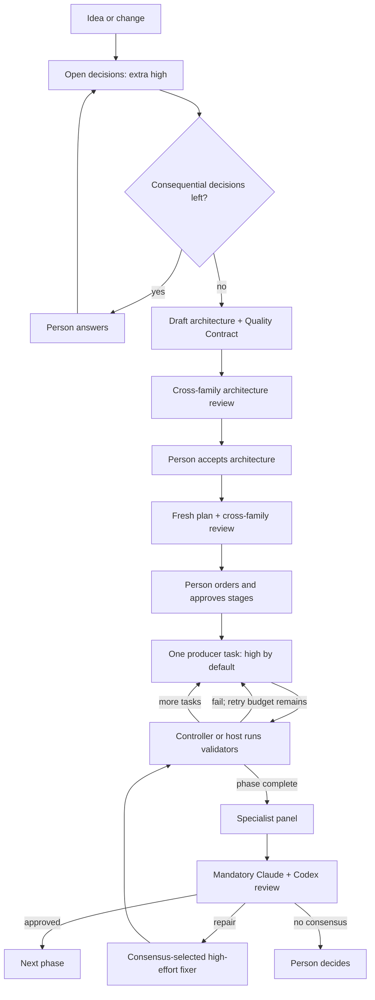

<!--
Project:  PeerFoil  |  File: docs/PeerFoil-Method.md
Authors:  Gabriel Mongefranco (@gabrielmongefranco)
Created:  2026-09-04  |  Modified: 2026-09-04
Summary:  Defines PeerFoil's normative multi-model delivery method for software and other reviewable work.
SPDX-License-Identifier: GFDL-1.3-or-later
-->

# PeerFoil

## A progressive, coding-first, multi-model delivery method for people building mostly alone

- **Version:** 1.2, 4 September 2026
- **Status:** Product and architecture proposal
- **Software license intent:** `GPL-3.0-or-later`
- **Documentation license intent:** `GFDL-1.3-or-later`
- **Repository:** <https://github.com/gabrielmongefranco/peerfoil>
- **Publication status:** Pre-release; packages and binaries are coming soon.

## 1. Product definition

PeerFoil is a method, a shareable set of Agent Skills, and eventually a small local controller for turning an idea into a reviewed deliverable with independent AI model families that check each other. Software development is its flagship use: architecture and planning are separated from implementation, code is produced in bounded tasks, and another model family reviews the result against fresh evidence.

It is designed first for professional and “vibe” developers working alone or with occasional help from one friend. It aims to supply some of the architecture, testing, accessibility, security, privacy, reliability, documentation, and release discipline normally distributed across a team. The same lifecycle can produce documentation, business plans, research reports, and other reviewable artifacts through lightweight project packs. Supporting domain experts with no software-engineering experience is a later usability goal, not a promise of the first releases.

PeerFoil is not another coding agent. It reuses Claude Code, Codex, Git, Agent Skills, MCP, project toolchains, and local-model runtimes. It contributes only the missing workflow: deliberate decisions, fresh handoffs, bounded independent review, controller-owned evidence, plan revision, and durable lessons.

No provider-generated proposal is authoritative merely because a capable model wrote it. Model output is design input; user-approved decisions, recorded provenance, verified evidence, and accepted project artifacts are the authority.

> Resolve consequential decisions. Approve the architecture and order of work. PeerFoil then plans, produces, validates, reviews, repairs, remembers, and resumes, interrupting only for decisions that genuinely require a person.

PeerFoil raises the quality floor; it does not certify that software or any other deliverable is safe, secure, accessible, correct, viable, or fit for a regulated purpose.

### One method, three releases

The same workflow ships in progressively stronger forms:

| Release | Deadline from project start | What makes it useful | Assurance boundary |
|---|---:|---|---|
| **PeerFoil Skills 0.1** | Day 5 | A shareable Claude Code plugin and portable Markdown skills implement the complete guided software workflow, plus a small documentation reference pack, using the official Codex plugin | Prompt- and file-guided. Useful, but not deterministic or crash-proof |
| **PeerFoil Core Alpha 0.2** | Day 13 | A small local CLI consumes the same artifacts and mechanically runs tasks, validation, evidence capture, recovery, and one dual-model phase review | First controller-enforced release; deliberately narrow and software-first |
| **PeerFoil 1.0** | No later than week 26 | Full bounded review and repair, change impact, memory, MCP policies, local models, mature project packs, quality/release gates, and hardened cross-platform delivery | Complete scope defined in this document |

The Skills release is not thrown away when Core appears. Its prompts, templates, and review skills remain the human-readable policy and the interactive interface. Core progressively replaces prompt discipline with mechanical enforcement.

## 2. Default models and effort

PeerFoil uses stable role aliases and resolves concrete model identifiers and supported effort controls during setup. A fallback is visible and recorded; an unsupported effort or undeclared substitution stops the run.

| Role | Default | Fallback | Effort | Authority |
|---|---|---|---|---|
| Initial evaluator | Claude Code with Fable | Claude Code with Opus | Extra high | Decisions only |
| Architect | Fresh Claude Code session with Fable | Fresh session with Opus | Extra high | Architecture only |
| Planner | Fresh Claude Code session with Fable | Fresh session with Opus | High | Plan only |
| Change steward | Claude Code with Fable | Claude Code with Opus | High; extra high for architecture changes | Plan revisions only |
| Producer; `Coder` in Software Pack | Codex 6 | GPT-5.6 Sol | **High by default** | One bounded task |
| Reviewer A | Claude Fable | Claude Opus | Extra high | Read-only |
| Reviewer B | Codex 6 | GPT-5.6 Sol | Extra high | Read-only |
| Repair producer | Exact configured agent selected by both reviewers | Any qualified configured producer | High only | Accepted repairs only |

Medium effort is allowed only for bounded, reversible, low-risk work with precise checks: isolated documentation sections, isolated tests, mechanical refactors, formatting, or simple implementation. Authentication, authorization, personal data, migrations, public interfaces, new dependencies, parsing or uploads, permissions, concurrency, destructive data behavior, architecture changes, consequential financial assumptions, externally published claims, and every repair require high effort. Low effort is not part of the default production policy.

Beginning with Provider Beta, local models may occupy any role after passing that role’s qualification suite. The hosted defaults are routing preferences, not permanent commercial dependencies.

## 3. The six mechanisms

### 3.1 The referee rule

**A model’s claim that a command passed is not evidence.**

In Core, the controller runs every declared check and records its argument array, working directory, exit code, duration, tool version, relevant configuration hash, and exact commit. A model proposes checks; it cannot declare their outcome.

This record proves that a particular command produced a particular result. It does not prove that the command tested the right behavior or that the product is correct. Relevance comes from the Quality Contract, acceptance scenarios, and independent review.

PeerFoil Skills follows the same procedure, but the host agent runs and records commands. That is guided automation, not structural enforcement. Only Core can prevent a model-written assertion from being accepted as evidence.

### 3.2 Evidence-backed acceptance

Every task contains:

1. A plain-language observable outcome.
2. One or more verification methods.
3. Whether each item is required, advisory, or not applicable with a reason.

A verification method is one of:

- an executable command with an expected exit status or structured result;
- a structured inspection by an agent, browser, or platform tool with retained evidence;
- a human procedure with an expected result.

Commands are preferred whenever they can test the property honestly. They are not forced onto visual quality, domain meaning, architecture, documentation clarity, or assistive-technology behavior that a command cannot establish. Missing required evidence blocks completion. Bug fixes and sensitive changes require a regression test or an explicit explanation of why one cannot be constructed.

For the Software Pack, the first phase must produce a walking skeleton that installs, starts, and passes one end-to-end journey, however small. Other packs must produce an equally small but complete artifact that can be validated and reviewed through the entire lifecycle.

### 3.3 Cross-examination

No agent reviews or approves its own work. By default, no model family supplies the independent approval for work authored by that same family.

- Codex is the primary independent reviewer for architecture and plans authored by Claude.
- Claude is the primary independent reviewer for code authored by Codex.
- If another hosted or local model family authors an artifact, PeerFoil assigns its primary review to the strongest qualified family that did not author it.
- Both reviewers remain responsible for correctness, reliability, security, privacy, accessibility, maintainability, and release risk.

PeerFoil records the author agent, concrete model, canonical lineage root, and run identifier for each material artifact and change set. The model does not declare its own independence. The adapter resolves `lineage_root_id` from a pinned provider catalog or an Advanced, user-approved local-model manifest containing the base model, derivative relationship, source, and model digest. Aliases, quantizations, fine-tunes, and checkpoints of one base lineage remain one family unless independent lineage is established. Unknown or conflicting lineage is not eligible to satisfy cross-family approval and produces **Reduced assurance** rather than guessed independence. “Model family” and “cross-family” remain readable interface terms; reviewer eligibility is enforced using `lineage_root_id`.

Review assignment is provenance-aware:

1. The exact author agent and authoring run are always ineligible to approve their output.
2. A fresh reviewer from a different model family is the default primary reviewer.
3. A fresh same-family reviewer may add a useful secondary critique, but its approval does not satisfy the cross-family independence requirement.
4. If no qualified different-family reviewer is available, PeerFoil cannot claim normal assurance. It marks the result **Reduced assurance** and requires explicit human acceptance or waits for an independent reviewer.
5. If multiple lineage roots co-authored one inseparable change, a qualified third lineage reviews it; otherwise the person must accept Reduced assurance. PeerFoil prefers separately attributable artifacts and change sets so this is rare.

Architecture, planning, production, and review use fresh sessions with compact context packets. A reviewer sees the frozen evidence bundle, not the author’s persuasive transcript. The ordinary two-family relay therefore lets each family challenge the other’s work without exposing this routing complexity in the normal interface.

Authorship is a negative signal when selecting a repairer, not an absolute ban. The reviewers choose the most capable configured agent for the accepted findings. That agent becomes an author for the repair and is removed from its reviewer seat for that patch; a fresh reviewer from another family supplies the independent verification.

### 3.4 Effort follows risk and evidence

PeerFoil does not ask a model to grade its own difficulty. The controller derives effort from declared scope and project history.

1. Ordinary production starts at high effort.
2. A qualified low-risk task may run at medium.
3. A failed medium attempt is retried once at high.
4. A failed high attempt may go once to another qualified high-effort producer, then stops for review or a person.
5. Artifacts accumulate risk history. Repeated failed checks or high-severity findings make future tasks touching them sensitive.

The policy becomes more careful where the project has actually failed, without adding a learned classifier or opaque score.

### 3.5 Layered quality

The architect creates a compact **Quality Contract** from the selected project pack, critical outcomes or user journeys, data handled, trust boundaries, distribution method, and effective `AGENTS.md`. It activates only relevant checks while ensuring that an incomplete standards file does not erase baseline quality disciplines.

The baseline contract covers, when applicable:

- correctness and critical journeys;
- reliability, failure handling, upgrade, rollback, and recovery;
- security, privacy, permissions, and dependency risk;
- accessibility and usable interaction;
- factual traceability, calculation integrity, assumptions, and unsupported claims;
- maintainability, documentation, packaging, licensing, and release integrity.

Quality work is layered:

| Layer | What runs | When |
|---|---|---|
| Project validators | Existing build, type, lint, tests, link checks, formula checks, or other pack-defined validators | After every task |
| Focused automated checks | Secrets, dependencies, licenses, accessibility, citations, consistency, or other applicable checks | After affected tasks and at phase close |
| Specialist panel | Small focused skills over the change set and evidence | At every phase boundary |
| Dual independent review | Default: Claude and Codex at extra-high effort; fully local: two qualified distinct families | **After every phase** |
| Person | Product decision, accepted risk, required human check, or unresolved review | Only when needed |

PeerFoil Skills guides every applicable layer. Core Alpha initially enforces project commands, evidence, and one fixed dual-family review path; mechanical panel/check orchestration arrives in Review Beta. The specialist panel focuses attention; it never replaces the required two-family phase review. A distribution or release phase adds package/install checks, production dependency and license scans, notices, and an SPDX or CycloneDX SBOM. A library or private script does not receive irrelevant release work.

### 3.6 Standards become focused review skills

`AGENTS.md` remains authoritative. PeerFoil uses the highest available architecture model to propose focused review skills derived from its normative sections and from the baseline Quality Contract. The generated diff requires approval before use and after regeneration.

The starter pack contains four conditional reviewers:

- correctness and reliability;
- security and privacy;
- accessibility and UX;
- maintainability, documentation, licensing, and release integrity.

At most two additional project-specific reviewers are generated by default. This prevents a long standards file from becoming dozens of overlapping prompts. Each skill cites the rules it enforces and proposes commands where appropriate.

The review skills are independently useful. They can run in a compatible agent even when PeerFoil Core is absent.

## 4. The design conversation

Automation removes repetitive coordination, not the person’s product judgment.

### 4.1 A shrinking open-decisions list

The evaluator produces an **open-decisions list**, not an architecture. Each item contains:

- one plain-language question;
- two to four concrete choices;
- a recommendation and rationale;
- the consequence of choosing differently;
- `needs_person` or `assumed`.

Technical choices are translated into user-visible consequences. PeerFoil asks the person when a choice materially affects behavior, cost, privacy, ownership, portability, interoperability, deployment, or irreversible data handling. It assumes only low-impact, reversible implementation details.

Answers may reveal new decisions. The list is recomputed until `needs_person` is empty. Assumptions remain visible and can be overridden. The architecture is then written from the resolved decision set rather than from an entire chat transcript.

Before the architecture can govern planning, a fresh qualified reviewer from another model family checks it against the resolved decisions, constraints, non-goals, risks, and Quality Contract. The Architect disposes the findings but cannot approve its own revision. The person accepts the architecture only after required findings are resolved or explicitly accepted as risk. This gate allows one critique, one author revision, and one independent verification; a remaining blocker pauses for the person rather than opening an unbounded debate.

### 4.2 The person orders outcomes

The planner converts the independently reviewed and person-accepted architecture and Quality Contract into:

```text
Project > Phase > Stage > Task
```

- A **phase** is a releasable increment ending in full verification and dual-model review.
- A **stage** is a user-visible outcome within a phase.
- A **task** is the bounded unit assigned to one producer call.

A fresh qualified reviewer from another model family checks the plan for architecture coverage, dependencies, task boundaries, evidence, risk, and feasible sequencing. The Planner may revise it but cannot approve it. This gate also allows one critique, one revision, and one independent verification before pausing on an unresolved blocker. The person then sees the reviewed stage list with one-line outcomes and rough sizes. They may reorder, split, drop, or mark stages must-have or nice-to-have. Any material human change is revalidated and independently reviewed before production begins. Task decomposition, dependencies, evidence requirements, and effort remain beneath that simple view.

### 4.3 After approval, quiet automation

After independent architecture and plan review, architecture acceptance, and stage-order approval, PeerFoil interrupts only for:

- an unresolved product or domain decision;
- missing authentication or a required connected source;
- a destructive, production, deployment, or external action;
- a required human check or risk acceptance;
- review that cannot converge within its budget;
- a configured spending or time ceiling.

Failed tasks, bounded retries, discovered work, plan revisions, deferrals, and one repair cycle proceed automatically when the current release can enforce them. PeerFoil Skills follows the same flow but may require the user to invoke the next command because it has no controller.

## 5. Workflow and project packs

### 5.1 Universal lifecycle

Every project follows one fixed lifecycle:

```text
Define → Architect → Plan → Produce → Validate → Review → Repair → Approve
```

The canonical planning hierarchy is also shared:

```text
Project → Phase → Stage → Task
```

A phase is a reviewable or releasable increment. A stage is a user-visible outcome. A task is one bounded producer assignment. A project pack changes the domain policy and labels, not the lifecycle or its governance.



Every transition updates the plan or evidence record before another task begins.

### 5.2 Neutral core vocabulary

Software terminology remains familiar in the Software Pack, while Core uses artifact-neutral concepts:

| Core concept | Software Pack | Documentation Pack | Business Plan Pack | Research Report Pack |
|---|---|---|---|---|
| Workspace | Repository | Document workspace | Planning workspace | Research workspace |
| Artifact | Source, test, or configuration | Section, diagram, or source | Narrative, model, or market evidence | Question, source, dataset, or synthesis |
| Producer | Coder | Writer or technical author | Analyst or writer | Researcher or synthesizer |
| Change set | Patch or commit | Revision | Narrative or model revision | Evidence or synthesis revision |
| Validator | Build, lint, test, or scanner | Link, structure, terminology, or style check | Formula, source, and consistency check | Citation, source-quality, and traceability check |
| Acceptance contract | Quality Contract | Editorial and technical contract | Evidence and viability contract | Evidence and methodology contract |
| Deliverable | Working release | Publishable document | Reviewed business plan | Reviewed research report |

These are protocol concepts, not an attempt to disguise every activity as coding. Each pack may display the vocabulary natural to its users.

### 5.3 Project-pack contract

A project pack is a small, versioned collection of Markdown plus JSON or YAML. It defines:

- terminology and normal-interface labels;
- expected artifact types and deliverables;
- default phases, stages, and task shapes;
- producer and reviewer roles with effort defaults;
- eligible skills and requested MCP capabilities;
- validators and executable, inspectable, or human evidence rules;
- specialist review lenses;
- acceptance and completion criteria.

Packs configure PeerFoil's fixed lifecycle. They are not arbitrary workflow programs and do not get controller code execution merely by being installed. A pack cannot override the effective `AGENTS.md`, grant itself credentials, widen permissions, make a failed required check pass, disable provenance, or permit an author to approve its own output. External pack content is pinned, license-checked, and treated as untrusted until accepted.

PeerFoil ships and matures packs in this order:

| Pack | Position | Scope |
|---|---|---|
| **Software** | Default and flagship | Most capable path; architecture, planning, code, tests, security, accessibility, release evidence |
| **Generic** | Minimal extension base | Small artifact-oriented workflow for custom packs and early experiments |
| **Documentation** | First non-code reference | Audience, information architecture, outline, sections, examples, diagrams, technical/editorial review |
| **Business Plan** | Before 1.0 | Thesis, customers, market evidence, operations, risks, assumptions, financial model, go-to-market, executive summary |
| **Research Report** | Before 1.0 | Questions, search strategy, evidence ledger, synthesis, citations, limitations |
| **Proposal/RFP** | Later extension | Requirements extraction, compliance matrix, response drafting, evidence, final compliance review |

Software and a basic Generic Pack define the initial schema. A small Documentation Pack in the Skills release proves that the protocol is not code-bound. Core Alpha remains software-first; non-code packs become polished progressively before 1.0. The goal is to generalize the artifact and review protocol, not every tool integration.

### 5.4 Non-code evidence and review

Non-code work still requires evidence, but not everything can or should become a command. A pack classifies important statements and results as:

- verified facts with sources and retrieval or publication dates;
- calculated results with formulas, units, inputs, and reproducible checks;
- explicit assumptions with owners and sensitivity;
- model judgments, clearly labeled as judgment;
- unsupported claims that block acceptance until supported, revised, or explicitly accepted as risk;
- inspectable qualities such as consistency, readability, structure, and accessibility;
- human checks where domain judgment or lived interaction is necessary.

The Documentation Pack separates technical accuracy from editorial quality. Its validators can check links, headings, terminology, required sections, citations, readability indicators, and generated-output consistency. Its independent reviewers examine audience fit, clarity, omissions, accessibility, examples, and factual accuracy.

The Business Plan Pack keeps the narrative, assumptions, evidence, and calculations traceable. Its specialist lenses include a skeptical investor, customer advocate, operating-feasibility reviewer, financial-model reviewer, and evidence reviewer. Reviewers cannot turn a weak assumption into a verified fact by agreeing with it.

The Research Report Pack records queries, inclusion choices, evidence provenance, source dates, contradictions, and limitations. It does not represent model synthesis as primary evidence.

Markdown, structured data, and source-controlled diagrams are preferred working formats. Binary deliverables such as DOCX, PDF, or slide decks should normally be generated from reviewable source artifacts; where that is impractical, PeerFoil retains inspectable render evidence and the editable source of record.

## 6. Durable artifacts and local state

Accepted project truth is ordinary text in version control:

```text
.peerfoil/
  project.json             selected pack, settings, role aliases, and schema version
  decisions.md             open decisions, answers, assumptions, consequences
  architecture.md          goals, decisions, constraints, non-goals, risks
  quality.md               applicable Quality Contract and evidence methods
  plan.md                  human view of phases, stages, tasks, and revisions
  plan.json                machine-valid task/dependency/evidence representation
  history.jsonl            compact redacted accepted transitions only
  provenance.jsonl         accepted run, model, lineage-root, and artifact mappings
  evidence/phase-01.json   command metadata and retained evidence references
  reviews/phase-01.md      human-readable review and dispositions
  packs/                   pinned project-pack manifests or project overrides
  glossary.md              project vocabulary and data meaning
  lessons.md               accepted lessons with source and review date
skills/                    canonical portable skills
AGENTS.md                  authoritative project standards
CLAUDE.md                  optional minimal provider bridge
```

Raw command output, model transcripts, temporary attempts, provider session identifiers, caches, private MCP payloads, and machine-specific notes stay in ignored local application data with size and retention limits. They are never committed by default. Durable provenance retains only internal run IDs, model and lineage identifiers, lineage-evidence references, artifact or change-set digests, and review eligibility—not private provider sessions or transcripts.

`history.jsonl` and `provenance.jsonl` are single-writer and store only schema-versioned, redacted accepted transitions, evidence references, and the provenance required to re-evaluate reviewer independence—not raw output. A partial final line after a crash is ignored. The accepted Markdown/JSON artifacts and Git history are sufficient to reconstruct usable state and its assurance basis on another machine. A disposable SQLite index may be generated later for search or diagnostics; it is not canonical and no database service is required.

## 7. PeerFoil Skills: useful in five days

PeerFoil Skills is the complete guided workflow expressed through Markdown skills, agent definitions, project packs, templates, and Claude Code plugin metadata. It requires no PeerFoil executable, service, database, or PeerFoil account. It does require Git, Claude Code, the selected pack's applicable toolchain, and—when using the default cross-vendor route—the Codex CLI/plugin and its own authentication.

### 7.1 Package contents

The initial marketplace repository contains:

```text
.claude-plugin/marketplace.json
plugins/peerfoil/
  .claude-plugin/plugin.json
  agents/
    evaluator.md
    architect.md
    planner.md
    change-steward.md
    claude-reviewer.md
  skills/
    start/SKILL.md
    plan/SKILL.md
    produce-next/SKILL.md
    change/SKILL.md
    review-phase/SKILL.md
    resume/SKILL.md
    remember/SKILL.md
    settings/SKILL.md
    review-correctness-reliability/SKILL.md
    review-security-privacy/SKILL.md
    review-accessibility-ux/SKILL.md
    review-maintainability-release/SKILL.md
  templates/
  packs/
    software/
    generic/
    documentation-reference/
  references/
```

The orchestration skills are Claude-specific where they call the official Codex plugin. The Markdown agent definitions give evaluator, architect, planner, change-steward, and Claude-review roles fresh context and explicit read/write boundaries; the coordinating host session is not silently reused as an independent reviewer. The four specialist review skills use the portable Agent Skills format and can be reused by other compatible agents.

### 7.2 Exact Codex bootstrap

Adding the marketplace does not install its plugin. The supported Claude Code sequence is:

```text
/plugin marketplace add openai/codex-plugin-cc
/plugin install codex@openai-codex
/reload-plugins
/codex:setup
```

`/codex:setup` verifies the Codex CLI and authentication and can offer installation when npm is available. The current plugin requires Node.js 18.18 or later and either a ChatGPT account supported by Codex or an OpenAI API key. It reuses the local Codex CLI’s authentication and configuration. [Official installation and requirements](https://github.com/openai/codex-plugin-cc#install).

A bootstrap prompt may ask Claude to verify prerequisites and guide installation, but the product does not pretend that an uninstalled skill can install itself. Shell equivalents may be automated only when the user’s environment and permission policy support them.

PeerFoil itself is then installed from its marketplace:

```text
/plugin marketplace add <publisher>/peerfoil
/plugin install peerfoil@peerfoil
/reload-plugins
/peerfoil:start
```

The PeerFoil marketplace name and publisher are finalized before release.

### 7.3 Codex integration rules

The official plugin supplies Codex review, adversarial review, delegated work, handoff, status, result, cancellation, and setup functions. PeerFoil uses it instead of building a Claude-to-Codex bridge. [Codex plugin capabilities](https://github.com/openai/codex-plugin-cc#what-you-get).

For automated Skills workflows:

- Write tasks explicitly invoke a fresh Codex delegation with a resolved model and effort, wait for completion, and run sequentially.
- Independent follow-ups resume only the intended thread.
- Background jobs are reserved for read-only work unless the repository scopes are proven independent.
- The plugin’s optional stop-time review gate remains disabled because its maintainers warn that it can create long-running loops and drain usage limits.
- The plugin’s native review commands are user-invoked; the automated phase-review skill instead delegates a fresh, explicitly read-only Codex review task. Core later calls Codex non-interactively and validates structured output directly.

### 7.4 User experience

Normal use exposes only:

```text
/peerfoil:start <idea or change>
/peerfoil:change <request>
/peerfoil:status
/peerfoil:resume
/peerfoil:remember <lesson>
```

First use is deliberately short:

1. `/peerfoil:start` checks Git, Claude, the Codex plugin/CLI and authentication, project commands, and the effective `AGENTS.md`; a failed check gives one exact next action.
2. It asks **Personal or Work?** only when the standards profile cannot be inferred safely.
3. It asks at most three plain-language product questions at a time.
4. It presents one approval view: outcome, non-goals, assumptions, phase/stage order, and an honest cost range where usage data is available.
5. **Approve and build** starts the guided relay. The workflow stops only for one of the conditions in section 4.3.
6. Status stays compact: current phase/stage/task, active model, last check, and spend against any configured ceiling.

Architecture, planning, production, and reviewer commands remain internal. One `/peerfoil:settings` wizard appears only under **Advanced**; it manages models, effort mapping, pass budgets, standards sources, MCP access, local endpoints, costs, and skill pins without requiring hand-edited configuration.

### 7.5 Honest Skills Edition limits

PeerFoil Skills can guide the full workflow, use fresh model sessions, maintain artifacts, call Codex, run checks, and conduct cross-vendor review. It cannot structurally guarantee command evidence, pass counts, atomic state, crash recovery, or unattended progression. Its status therefore says **Guided**. Core is the first **Enforced** edition.

## 8. PeerFoil Core

Core is a small Go CLI for native Windows, macOS, and Linux. Alpha ships as checksummed development binaries; Release Beta adds free, verifiable release provenance and artifact signatures. Go is selected for the single-binary deployment and fast, standard-library-heavy implementation. The first release does not embed a model runtime, MCP client, web server, or workflow framework.

Core consumes the same skills, packs, and files as the Skills Edition. Architecture and planning remain transparent skill-driven model tasks; the binary validates their outputs and controls transitions rather than implementing a second prompt system.

### 8.1 Minimal components

| Component | Responsibility |
|---|---|
| State loop | Read current artifacts, choose the next valid transition, append a durable event |
| Provider adapters | Invoke Claude Code and Codex with explicit arguments, model, effort, input, and output schema |
| Project-pack loader | Validate a pinned pack and resolve its labels, artifacts, roles, validators, and review lenses |
| Plan validator | Validate dependencies, task scope, risk, evidence methods, and plan revision |
| Workspace manager | Version artifacts, create task worktrees where applicable, inspect changes, integrate validated work, and stop on unexpected mutation |
| Evidence engine | Run declared commands, register structured inspections and human checks, apply timeouts, redact outputs, and bind evidence to exact revisions |

Core uses direct process boundaries and Git. It does not add another agent framework.

### 8.2 Commands

The complete command surface remains small:

```text
peerfoil init
peerfoil doctor
peerfoil start "idea or change"
peerfoil change "request"
peerfoil status
peerfoil pause
peerfoil resume
peerfoil review
peerfoil remember "lesson"
peerfoil settings
```

The Day-13 alpha implements `init`, `doctor`, `start`, `status`, and `resume`; the remaining commands are added incrementally without changing artifacts. `settings` is the advanced configuration wizard and is omitted from normal help unless requested.

### 8.3 Core Alpha boundary

Core Alpha supports an existing, clean Git workspace with an initial commit and already-authenticated Claude Code and Codex CLIs. It provides:

- one supported default role mapping;
- the Software Pack plus a minimal Documentation Pack fixture that exercises the same neutral schemas;
- the decision interview, approved architecture, and fresh plan from the Skills artifacts;
- sequential tasks only;
- one task per Codex call in a dedicated worktree;
- configured project checks run by Core;
- authoritative command evidence;
- task-boundary crash recovery;
- one initial Claude/Codex phase-review round with cross-family primary approvals;
- a high-effort repair selected through the guided review skill and, when a repair occurs, one fresh cross-family verification round;
- native Windows, macOS, and Linux CI and smoke tests.

It defers polished non-code packs, arbitrary provider adapters, scanner installation, multi-round review debate, automated repair consensus, advanced change impact, memory classification, MCP synchronization, local-model implementations, parallel workers, submodules, LFS, and a dedicated GUI. These are committed six-month work or explicit post-1.0 exclusions, not hidden omissions.

## 9. Production and change intake

Core assigns one task per producer call. The Software Pack uses a short-named worktree branched from a dedicated integration branch, never from the live checkout. Other packs use the same Git-backed change-set and provenance protocol for text, structured data, diagrams, and generated artifacts. A task carries its plan revision and basis commit. Its changes integrate only after required evidence passes and the scope matches.

PeerFoil Skills does not manage worktrees mechanically. It runs one write task at a time, requires a clean workspace checkpoint, waits for the producer to finish, and never lets two agents edit concurrently.

Authorship is preserved at patch granularity. Each run records:

- a stable configured `agent_id`;
- a unique `agent_instance_id` and `run_id`;
- `provider_id`, concrete `model_id`, canonical `lineage_root_id`, lineage evidence, and resolution source;
- the basis commit and exact resulting patch or commit.

In the Skills Edition, the coordinator checkpoints a completed producer change before making any content edit. In the default Software Pack this is the Codex diff. Core captures and commits the producer's change set without rewriting it. Mechanical, byte-preserving application or merge retains the original attribution; any tidy-up, rewrite, generated conflict resolution, or manual content change becomes a separate change set attributed to its actual editor and receives its own cross-family approval. When attribution cannot be established, the item is treated as co-authored and cannot receive normal assurance from either involved family.

Worktrees isolate version-control changes; they are not an access-control boundary. Before and after every task, Core records the live checkout’s commit and status and stops on unexpected mutation. Agents and project commands otherwise inherit the user’s operating-system permissions.

Every producer-introduced TODO, unsupported claim, skipped check, deviation, and deferral becomes a plan amendment before another task begins.

A change request is accepted at any task boundary. The Change Steward produces an impact report and chooses one destination:

- current task or stage;
- next stage in the current phase;
- later phase;
- backlog with a reconsideration trigger;
- declined with a reason and trigger.

Current-stage placement may reopen completed work when the impact is explicit, the affected tasks are replanned, and all invalidated evidence will be rerun. It is not limited to changes that invalidate nothing.

Every outcome increments the plan revision, including backlog and decline. Architecture changes reopen only the affected decisions, request the necessary product judgment, and send the approved delta to a fresh planner. Unaffected tasks remain valid.

Commands that deploy, write production data, manage credentials, send external messages, or perform destructive operations always require explicit approval. PeerFoil automatically runs only declared project and quality commands within the current task’s policy.

## 10. Phase review and repair

At every phase boundary, PeerFoil freezes one evidence bundle containing:

- architecture, Quality Contract, standards, and plan revisions;
- requirement-to-task-to-evidence traceability;
- integrated diff and changed files;
- controller-run task and phase checks with commit/configuration hashes;
- specialist panel findings;
- TODOs, deviations, skipped checks, deferrals, and known risks;
- relevant documentation, migration, rollback, packaging, and release evidence.

The bundle also contains an artifact-and-change-set provenance map. In the default hosted profile, Claude and Codex separately review the complete bundle at extra-high effort. A fully local profile uses the two strongest qualified distinct lineage roots. PeerFoil assigns primary approval item by item: Codex for Claude-authored work, Claude for Codex-authored work, and a qualified non-author lineage for work from another provider. A same-lineage reviewer may still find defects, but cannot provide that item’s independent approval. Specialist findings focus attention but do not limit review scope. Reviewers exchange only a normalized finding ledger, not transcripts.

Each response must disposition every open blocker/high finding as `agree`, `disagree_with_evidence`, or `needs_evidence`. Silence becomes `needs_evidence`. Objective failed checks cannot be voted away. Only the person may accept risk, and the resulting phase status is **Passing with accepted risks**, never **Passing**.

### Convergence budget

- Default maximum: **six passes per reviewer for the entire phase**, including post-repair verification.
- Advanced hard ceiling: **eight passes per reviewer**; it can never be raised further.
- One pass per configured reviewer is reserved from the outset for the post-repair bundle. Pre-repair reconciliation may consume at most the remaining passes. If the review reaches the reserve without an accepted repair plan and an eligible different-lineage verifier, PeerFoil pauses instead of spending the verification pass or beginning an unverifiable repair.
- Stop early when every blocker/high finding has matching dispositions, no required check fails or lacks evidence, and no material finding appeared in the latest complete round.
- Exhaustion pauses with a short written disagreement; it never manufactures consensus.

### Repair selection

The controller ranks eligible configured producers using required capabilities, tool access, authorship, which model found the defect, and project success history. Each reviewer signs the exact same `selected_agent_id` or vetoes it with evidence and names an alternative.

- Default maximum: **three selection passes per reviewer**.
- Advanced hard ceiling: **four passes per reviewer**.
- The chosen agent repairs at high effort in a fresh worktree.
- The repairer cannot review or approve that repair. PeerFoil assigns independent verification to a fresh qualified reviewer with a different canonical lineage root.
- One automatic repair cycle is allowed per phase.
- All affected evidence is rerun. Both review seats inspect the new bundle using their reserved phase pass, but only an eligible non-author lineage can independently approve each repaired item.

A second repair cycle, unresolved blocker, failed required check, or exhausted budget returns control to the person.

## 11. Shared context, memory, skills, MCP, and local models

### 11.1 Context packets

Each role receives a compact packet assembled from accepted artifacts, relevant files, task-specific evidence, selected skills, approved lessons, and permitted MCP results. Raw chat history is not project truth. A fresh session can reproduce its basis from the packet and recorded revisions.

### 11.2 Personal and work standards

Setup offers:

- the repository’s existing effective `AGENTS.md` chain;
- a configurable personal source URL or local path;
- a separately configured work source URL or local path.

Moving sources resolve to a pinned revision and digest. Existing repository rules are never silently overwritten. Example sources may include [Privatium](https://github.com/gabrielmongefranco/privatium) and [EFDC Repo Template](https://github.com/DepressionCenter/EFDC-Repo-Template), but they are not hard-coded defaults.

Provider bridge files expose the same effective policy without duplicating its content. Setup checks instruction-size limits and reports potential truncation.

### 11.3 Automatic skills

The Skills Edition relies on native description matching for optional skills and explicitly invokes essential workflow skills. This is convenient but model-dependent.

Context Beta adds Core’s deterministic eligibility filter without embeddings or a vector database. It reads skill metadata and intersects role, task type, stack, paths, risk, operating system, shell, required tools, MCP needs, and adapter capability. It gives the native loader only the small eligible set and records each offered and loaded skill’s source, revision, digest, and reason.

External skills are pinned and license-checked. A skill cannot widen task permissions or rewrite its own locked policy.

### 11.4 MCP and internal knowledge

MCP servers are declared once. For every Core invocation, the adapter renders an ephemeral, role-specific provider configuration containing only allowlisted servers and tools, with deny-by-default filtering at the adapter boundary. Credentials remain referenced through the provider, environment, editor secret storage, or operating-system facility; they are not copied into the temporary configuration. The configuration is removed after the invocation according to the local retention policy.

An adapter that cannot isolate configuration and prevent access to unlisted MCP tools is not qualified for role-scoped MCP in Enforced mode. A task that requires such access blocks; optional MCP capabilities are omitted with a visible record. The Skills Edition can guide equivalent provider-native configuration but labels this protection **Guided**, not enforced. Required sources are health-checked; failure blocks instead of disappearing silently.

Raw private knowledge-base payloads and secrets are not committed. Retrieved content is marked untrusted and cannot override `AGENTS.md`, the plan, or permissions. Before private material is sent to a hosted model, the policy identifies the destination and applies the selected personal/work egress rule.

### 11.5 Memory and lessons

`peerfoil remember` accepts knowledge the person wants preserved. PeerFoil classifies it, rewrites it for machine use with a trigger condition, proposes a scope, and asks at most one clarifying question. Verifiable facts are checked before promotion.

| Observation | Durable form |
|---|---|
| Recurring defect | Regression test or lint rule |
| Architectural consequence | Decision record |
| Reusable procedure | Skill |
| Stable project rule or preference | Proposed `AGENTS.md` diff |
| Data meaning | Glossary entry |
| Machine-specific fact | Local machine note, never committed |
| Useful non-binding fact | Sourced, dated lesson |

Personal and work memory remain separate. Cross-project sharing is explicit, never automatic.

### 11.6 Local models

Local models use the same seat interface as hosted models. Planned adapters include:

- Ollama discovery and health checks;
- OpenAI-compatible endpoints, including vLLM;
- optional OpenCode as a software-production harness;
- Transformers.js through an external helper or compatible local gateway when appropriate, without embedding a JavaScript runtime into the Go binary.

An unqualified local model starts read-only. Role fixtures test structured output, instruction following, change-set production, tool use, evidence handling, timeouts, and context limits. Pack-specific fixtures add coding, documentation, analysis, or research capabilities as needed. Any model may qualify for architecture, planning, production, repair, or review. Policy-complete review requires a qualified reviewer with a different canonical lineage root from every author of the item. Two aliases, quantizations, fine-tunes, or checkpoints of one base model may provide useful secondary review, but they do not become independent by using different endpoint names. A fully local normal-assurance route requires two qualified roots with pinned lineage evidence; unknown lineage is labeled **Reduced assurance**.

The Day-13 schema already represents local seats so later adapters do not require an architecture rewrite. The actual adapters arrive within the six-month roadmap.

## 12. Cross-platform, authentication, and cost

### Cross-platform contract

PeerFoil Core targets native Windows, macOS, and mainstream Linux on x64 and arm64 where CI builds and tests the release. WSL is optional, never the Windows default.

Implementation rules:

1. Launch executable/argument arrays without shell interpolation.
2. Store canonical project paths with `/`; convert only at the I/O boundary.
3. Use short branch and worktree names.
4. Parse machine-readable Git output.
5. Keep temporary worktrees, raw logs, and caches in local application data, not synchronized or network storage.
6. Terminate the complete process tree on interrupt and timeout, including a Windows Job Object or validated tree-kill fallback.
7. Never mix native and compatibility-layer paths within a project.
8. Test spaces, Unicode, apostrophes, CRLF, case-only changes, dirty-checkout refusal, crashes, and timeouts on all three operating systems from the first commit.

PeerFoil Skills inherits Claude Code, Git, Node.js, Codex plugin, and project-toolchain requirements. PeerFoil Core itself is a single binary with no required language runtime.

### Authentication and subscriptions

PeerFoil stores no vendor token. It invokes provider-supported login flows and reuses the selected CLI’s authentication. The default Claude/Codex route may consume existing plan allowances or API billing; setup shows which route resolved.

No non-LLM commercial subscription, hosted control plane, database service, license server, paid CI, or telemetry account is required. A fully local configuration can remove commercial model providers after qualified local seats are installed.

Release signing uses no-cost open tooling such as Sigstore plus published checksums. Native Apple notarization or Windows reputation certificates may be offered by distributors, but are optional and never a runtime or release requirement.

### Cost controls

The default path records model, effort, and usage evidence. By the Review Beta it adds:

- advisory and hard per-phase ceilings;
- a pre-phase estimate based on local history;
- visible spend against the ceiling;
- measured token enforcement for API-key configurations;
- explicit warning when a premium model uses credits outside ordinary plan allowance.

Mandatory dual independent review is retained. The hosted default remains Claude plus Codex; a fully local route uses two qualified distinct families. Cost is controlled by compact frozen bundles, specialist preflight, early convergence, and strict pass budgets—not by skipping a reviewer.

## 13. Delivery plan

Deadlines are cumulative from project start and are paired with fixed exit gates. Work outside those gates is deferred first; the gates themselves are not weakened to meet a date. If either the date or gate is missed, the miss is reported plainly rather than relabeling an incomplete release as shipped. The early gates are intentionally narrow so both commitments remain credible.

### 13.1 Day 5: PeerFoil Skills 0.1

| Day | Deliverable |
|---:|---|
| 1 | Marketplace/plugin scaffolding, neutral artifact and pack contract, default model policy, settings wizard, and the start/decision skill |
| 2 | Fresh evaluator/architect/planner agent definitions plus architecture, Quality Contract, planning, ordered-stage skills, and Software Pack |
| 3 | Explicit Codex delegation, one-task build, change, status/resume, and plan-amendment rules |
| 4 | Fresh Claude-review agent, mandatory dual-review skill, repair selection, remember/lesson promotion, and four portable panel skills |
| 5 | Fresh-session trigger tests, two software fixtures, a small Documentation Pack fixture, plugin validation, three-OS smoke tests, license/notices, and public documentation |

**Exit gate:** On two small software repositories, a user with authenticated Claude Code and Codex can install the skills, discuss an idea, approve architecture/stage order, delegate at least one bounded implementation task to Codex, run recorded project checks, perform independent Claude/Codex phase review, revise the plan, and resume from checked-in artifacts. The same artifacts and review protocol must produce and review one small Markdown deliverable through the reference Documentation Pack. The documentation labels the workflow **Guided**.

### 13.2 Day 13: PeerFoil Core Alpha 0.2

Days 6–13 add the Go CLI, pack and plan validation, direct provider invocation, worktrees, authoritative evidence, redacted state, recovery, diagnostics, packaging, and one fixed dual-model phase-review round.

**Exit gate:** In an existing clean Git workspace with supported Claude Code and Codex CLIs already authenticated, Core consumes the skills-generated architecture, pack, and plan; executes a sequential software task in a dedicated worktree; runs configured checks itself; records exact-revision evidence; survives interruption at a task boundary; performs one dual-family review round with provenance-based cross-family approvals; and guides one high-effort repair followed by fresh cross-family verification when needed. It must also process the small Documentation Pack fixture without controller changes. Expected operations leave the live checkout unchanged, and an injected out-of-scope mutation is detected and blocks on Windows, macOS, and Linux.

This is a technical alpha for developers already using coding agents. It is usable, but it is not the complete autonomous product.

### 13.3 Weeks 3–26: complete the product

| Time | Release | Committed scope | Exit evidence |
|---|---|---|---|
| Weeks 3–4 | Reliable Core | Structured plan/packet validation, stable pack manifest, Documentation Pack alpha, timeout and process-tree handling, fallback/effort detection, retry escalation, Gitleaks/OSV detection, strong diagnostics | Injected command, model, pack, timeout, malformed-output, and restart failures recover or stop honestly on all three systems |
| Weeks 5–8 | Review Beta | Frozen bundles, standards- and pack-derived panels, mandatory dual extra-high review, normalized ledger, six-pass default/eight-pass ceiling, exact fixer consensus, one repair cycle | Seeded software defects and unsupported document claims block, are repaired, and are independently reverified; forced disagreement pauses |
| Weeks 9–12 | Planning Beta | Impact-aware change placement, selective invalidation, plan revisions, TODO/deviation capture, requirement-to-evidence traceability, pack-aware Quality Contracts, Business Plan and Research Report beta packs | A mid-stage change reopens affected work without invalidating unrelated tasks or accepting stale software or non-code results |
| Weeks 13–16 | Context Beta | Personal/work standards profiles, approved panel regeneration, deterministic skill eligibility, shared context, manual and discovered lessons, role-scoped MCP configuration and health checks | A required MCP outage blocks; private payloads remain uncommitted; a recurring lesson becomes a test, skill, or standards proposal |
| Weeks 17–20 | Provider Beta | Model/fallback UI, subscription/API diagnostics, Ollama, OpenAI-compatible/vLLM, optional OpenCode, Transformers.js external-helper path, role qualification | Hosted and qualified local seats can be exchanged without changing architecture, plan, or review formats |
| Weeks 21–24 | Release Beta | Cross-platform hardening, checksummed and freely signed release artifacts, schema migration, conditional package/SBOM/notices gate, cost ceilings, VS Code tasks/terminal integration, finished Software, Documentation, Business Plan, and Research Report packs, and a small custom-pack kit | Complete acceptance matrix passes, including paths, cancellation, corrupt local state, clone/reconstruction, package install, offline local route, and every built-in pack fixture |
| Weeks 25–26 | PeerFoil 1.0 | Buffer, usability fixes, dependency/license audit, release candidate, migration guide, five-minute PeerFoil setup path | With supported provider or local-runtime prerequisites already installed and authenticated, fresh users complete PeerFoil setup and one reference phase without editing configuration; all required six-month capabilities pass |

Dedicated web/desktop interfaces and a large VS Code activity view remain outside 1.0. Claude Code’s VS Code integration and the PeerFoil CLI provide the initial editor experience.

## 14. Product boundaries

PeerFoil deliberately excludes:

- a hosted control plane, required account, daemon, or server;
- multi-user organizations, RBAC, billing, chargeback, or live collaborative state;
- a database as project truth;
- a general workflow language, project-management suite, or second agent loop;
- a provider or plugin marketplace of its own beyond the PeerFoil release channel;
- more than one write task at a time in the initial product;
- automatic deployment, production writes, credential changes, or external messages;
- an always-running review gate or unlimited autonomous loops;
- a web dashboard, desktop application, or enterprise project-management suite;
- an office-suite editor, financial-data vendor, research database, or domain-expert replacement;
- a promise that the first two releases are suitable for nontechnical users;
- a required paid service other than whichever LLM inference the user selects.

The selected pack's acceptance contract remains proportional. It does not run browser accessibility checks on a CLI, generate an SBOM for an artifact that is not distributed, or pretend a subjective review is executable evidence.

## 15. Open-source reuse and GPLv3 policy

PeerFoil software and operational artifacts are intended to be licensed `GPL-3.0-or-later`. This includes source code, tests, `skills/`, `agents/`, `packs/`, `templates/`, plugin metadata, configuration, schemas, and executable or machine-consumed Markdown. Human-facing prose documentation—including `README.md`, `PeerFoil-Method.md`, `architecture.md`, `implementation-plan.md`, and later `docs/` content—is intended to be licensed `GFDL-1.3-or-later` with no Invariant Sections, Front-Cover Texts, or Back-Cover Texts, unless a file carries a different SPDX identifier. A file's explicit SPDX identifier wins over its path. PeerFoil favors separate, user-installed tools and small GPLv3-compatible dependencies.

| Need | Existing component | Treatment |
|---|---|---|
| Claude-to-Codex cooperation | [openai/codex-plugin-cc](https://github.com/openai/codex-plugin-cc), Apache-2.0 | Foundation of Skills Edition; installed separately and pinned/tested |
| Portable skill format | [Agent Skills](https://agentskills.io/specification) | Adopt for reusable review and workflow skills |
| Codex automation | [Codex CLI](https://github.com/openai/codex), Apache-2.0 | External CLI/app-server integration; reuse authentication and non-interactive execution |
| Architecture/planning runtime | Claude Code, vendor terms | External CLI; never bundled |
| Versioning and worktrees | Git, GPL-2.0-only | External executable; never linked or bundled by default |
| Secret scanning | [Gitleaks](https://github.com/gitleaks/gitleaks), MIT | Optional detected external check |
| Dependency vulnerability scanning | [OSV-Scanner](https://github.com/google/osv-scanner), Apache-2.0 | Optional detected external check |
| Browser/accessibility evidence | [Playwright](https://github.com/microsoft/playwright) and [axe-core](https://github.com/dequelabs/axe-core), Apache-2.0/MPL-2.0 | Installed in applicable projects; invoked, not bundled into Core |
| Planning/skill patterns | [Spec Kit](https://github.com/github/spec-kit) and [Superpowers](https://github.com/obra/superpowers), MIT | Reuse selected patterns with attribution; do not add another orchestrator |
| Local models | [Ollama](https://github.com/ollama/ollama), [vLLM](https://github.com/vllm-project/vllm), [OpenCode](https://github.com/anomalyco/opencode), and [Transformers.js](https://github.com/huggingface/transformers.js) | Optional external runtimes; audit runtime and model licenses separately |

A command-line boundary reduces coupling but does not erase license obligations. PeerFoil audits copied skills, templates, plugin content, Go modules, release archives, model artifacts it redistributes, and required notices. The public repository must include the complete software and documentation license texts before its first release.

The release gate:

- permits verified GPLv3-compatible permissive and copyleft dependencies under their obligations;
- preserves Apache notices and MPL file-level source obligations;
- treats LGPL, AGPL, compound SPDX expressions, public-domain claims, and custom licenses as manual-review cases;
- may exclude AGPL from the combined core as a product-policy choice without falsely calling it GPL-incompatible;
- rejects unknown, noncommercial, added-restriction, Commons Clause, SSPL, RSAL, BSL, or other source-available-only licenses from the combined distribution;
- generates `THIRD_PARTY_NOTICES`, a release SBOM, and an exact dependency report for distributed artifacts.

This is an engineering compatibility policy, not legal advice. The exact released graph is reviewed before publication.

## 16. Success criteria

PeerFoil succeeds only if:

1. PeerFoil Skills ships by Day 5 and provides the complete guided architecture-to-plan-to-produce-to-review workflow without a PeerFoil executable.
2. Core Alpha ships by Day 13 and mechanically enforces its documented narrow, software-first vertical slice.
3. All committed capabilities in the roadmap ship no later than week 26.
4. Normal setup and operation require no configuration-file editing.
5. The open-decisions list reaches zero consequential unanswered items before architecture review; architecture and plan each receive eligible cross-family review before governing production.
6. The person controls stage order without needing to understand task internals.
7. The first Software Pack phase installs, starts, and passes one end-to-end user journey; other packs define an equally observable first deliverable.
8. Every task has observable outcomes and executable, inspectable, or explicit human evidence.
9. In Core, only controller-run command results are authoritative execution evidence.
10. Producer effort is high by default; medium is limited to qualified low-risk tasks; repairs are always high.
11. Two configured highest-capability reviewers inspect every phase—Claude and Codex by default, or two qualified distinct families in a fully local profile—and every material artifact or patch receives primary approval from a family that did not author it.
12. Review stops within six passes each by default and never exceeds eight; repair selection stops within three by default and never exceeds four.
13. Both reviewers sign the same exact repair agent; one automatic repair cycle is the maximum.
14. Objective failures and missing required evidence cannot be voted away.
15. Every change, TODO, unsupported claim, deviation, skipped check, and deferral creates a plan revision and disposition.
16. `AGENTS.md` remains authoritative and generated panel changes require a reviewable diff.
17. Pertinent skills and allowed MCP sources are selected automatically and recorded.
18. Accepted context, reviews, memories, and lessons survive a clone without raw private payloads or secrets.
19. Qualified Ollama, vLLM/OpenAI-compatible, OpenCode, and appropriate Transformers.js-backed roles fit the same workflow without hosted fallback.
20. Personal and work standards and memory never mix automatically.
21. The same software and documentation reference projects pass on native Windows, macOS, and Linux, including difficult paths and interruption recovery.
22. No non-LLM commercial subscription or hosted service is required.
23. The distributed combined software and operational artifacts contain only reviewed GPLv3-compatible material with required notices and release evidence; human-facing prose documentation carries the stated GFDL license, with an explicit SPDX identifier on ambiguous Markdown.
24. No authoring agent approves its own output; absence of a qualified cross-family reviewer is disclosed as Reduced assurance and requires explicit human acceptance.
25. A failed gate, exhausted budget, or unresolved consequential decision pauses honestly instead of inventing success.
26. The controller contains no software-only assumptions that belong in the Software Pack.
27. A pack can tailor artifacts, validators, skills, MCP capabilities, and review lenses without overriding `AGENTS.md`, permissions, provenance, evidence rules, or reviewer independence.
28. Documentation, Business Plan, and Research Report packs distinguish verified facts, calculations, assumptions, judgments, and unsupported claims, and retain editable sources for generated binary deliverables where practical.
29. Canonical author and reviewer lineage roots, their evidence references, and eligibility decisions survive a clone without exposing provider session data.

## 17. Honest limits

PeerFoil Skills is a guided preview. A model still coordinates the workflow, so pass counts, evidence, and state are only as reliable as the prompts and artifacts. Core exists to enforce those rules.

Core Alpha is a technical alpha for clean Git workspaces and supported Claude/Codex installations. It is not universal stack discovery, a polished nontechnical experience, mature non-code support, or the complete six-month product.

Automatic execution assumes that the repository, its dependencies, hooks, build scripts, and configured tools are trusted. Worktrees help attribute and isolate Git changes but do not restrict filesystem, network, process, or credential access; agents and commands run with the invoking user’s privileges. Untrusted projects should be handled in a disposable operating-system environment until a separately scoped containment feature exists.

Two model families can share blind spots. Cross-examination, specialist skills, deterministic checks, and fresh sessions reduce correlation; they do not remove it. Business plans remain forecasts rather than guarantees, and research summaries remain secondary analysis. High-stakes medical, regulated, safety-critical, financial, legal, or accessibility decisions may still require qualified human review.

The Day-5 and Day-13 commitments assume one experienced developer working with focused model assistance and aggressively protecting the stated narrow scope. The six-month commitment assumes sustained development, roughly half-time or more. Both dates and exit gates are commitments; missing either is reported plainly.

Model names, effort controls, plugin behavior, and authentication flows change. Setup detects capabilities, pins tested integrations where possible, records what actually resolved, and treats silent fallback as a defect.

The claims that cross-examination improves review, compiled standards improve adherence, and path-history escalation improves results are hypotheses until measured. Reference fixtures and real projects should compare defect detection, false positives, completion cost, and user interruptions against simpler baselines.

## Primary references

- [Project overview](../README.md)
- [PeerFoil architecture](architecture.md)
- [High-level implementation plan](implementation-plan.md)
- [Claude Code documentation](https://code.claude.com/docs)
- [Claude Code headless mode](https://code.claude.com/docs/en/headless)
- [Claude Code model configuration](https://code.claude.com/docs/en/model-config)
- [Claude Code skills](https://code.claude.com/docs/en/skills)
- [Claude Code plugins](https://code.claude.com/docs/en/plugins-reference)
- [Claude Code plugin marketplaces](https://code.claude.com/docs/en/plugin-marketplaces)
- [Codex plugin for Claude Code](https://github.com/openai/codex-plugin-cc)
- [Codex CLI](https://developers.openai.com/codex/cli)
- [Codex non-interactive mode](https://developers.openai.com/codex/non-interactive-mode)
- [Codex configuration](https://developers.openai.com/codex/config-reference)
- [Codex models and effort](https://developers.openai.com/codex/models)
- [Codex skills](https://developers.openai.com/codex/skills)
- [Agent Skills specification](https://agentskills.io/specification)
- [Model Context Protocol](https://modelcontextprotocol.io/)
- [OWASP Application Security Verification Standard](https://owasp.org/www-project-application-security-verification-standard/)
- [WCAG 2.2](https://www.w3.org/TR/WCAG22/)
- [Git worktrees](https://git-scm.com/docs/git-worktree)
- [Apache-2.0 and GPLv3 compatibility](https://www.apache.org/licenses/GPL-compatibility.html)
- [GNU license list](https://www.gnu.org/licenses/license-list.html)
