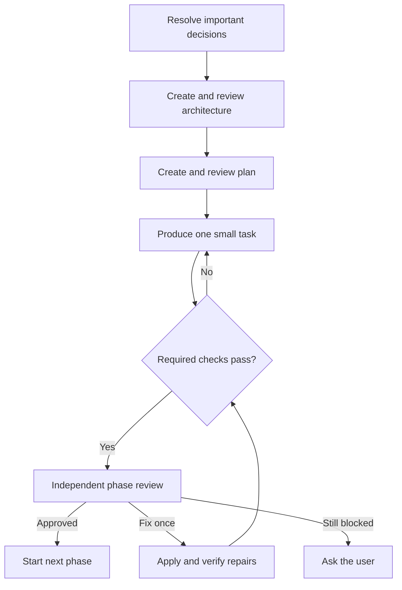

<!--
This file is part of PeerFoil.
docs/PeerFoil-Method.md
Author(s): Gabriel Mongefranco.
Created: 2026-09-04
Last Modified: 2026-09-04
Summary: Defines the PeerFoil workflow, its safeguards, and its planned releases.
Notes: See README for an overview and full license information.

Copyright © 2026 Gabriel Mongefranco

Permission is granted to copy, distribute and/or modify this document under the terms of
the GNU Free Documentation License, Version 1.3 or any later version published by the Free
Software Foundation; with no Invariant Sections, no Front-Cover Texts, and no Back-Cover
Texts. See <https://www.gnu.org/licenses/fdl-1.3.html>.
-->

# PeerFoil

## A practical way for independent AI models to plan, build, and review work together

[Return to the PeerFoil README](../README.md)

PeerFoil helps one person use several AI models without having to manage every handoff.
One model helps make the important decisions. Another creates the plan. Other models do
the work and check each other. PeerFoil keeps the plans, evidence, reviews, and lessons in
files that remain with the project.

Software development is the main use. PeerFoil can also support documentation, business
plans, research reports, and other work that can be divided into clear tasks and reviewed
against evidence. This page explains the complete method and which parts arrive in each
release.

## 1. Why PeerFoil exists

AI coding tools are useful, but they often share the same weaknesses:

- The same model makes a decision, writes the code, and decides that its work is correct.
- Important requirements disappear inside long chat histories.
- A test may be reported as passing without a reliable record of what ran.
- New requests are added without updating the original plan.
- Review can continue indefinitely, using time and model credits without reaching a
  decision.
- Useful lessons stay inside one conversation and are lost when a new session starts.

PeerFoil gives each model a limited job. It records who produced each important artifact,
uses a different model family for independent review, and asks for evidence before marking
work complete.

The goal is not to imitate a large development team. The goal is to help a solo developer
apply more of the care that a good team would normally provide: architecture, testing,
security, privacy, accessibility, documentation, and release checks.

PeerFoil can raise the quality floor. It cannot certify that an application, document,
plan, or report is correct or safe.

## 2. What the user sees

The normal workflow has five actions:

```text
peerfoil start
peerfoil change
peerfoil status
peerfoil resume
peerfoil remember
```

The Skills release uses equivalent `/peerfoil:*` commands inside Claude Code.

The user sees:

- the questions that require a decision;
- the proposed architecture and order of work;
- the current phase, stage, and task;
- a plain-language quality status;
- any problem that blocks progress; and
- the final review recommendation for each phase.

Model names, effort settings, review limits, connected tools, Model Context Protocol (MCP)
servers, local-model addresses, and cost controls stay under Advanced settings.

After the user approves the architecture and order of work, PeerFoil continues until it
needs one of these things:

- a product or domain decision;
- authentication or access to a required source;
- approval for a destructive, production, deployment, or external action;
- a human check that cannot be automated honestly;
- acceptance of a known risk; or
- help after the review or retry limit is reached.

## 3. Who does what

PeerFoil uses roles instead of tying its design to one provider. Each role receives only
the context and tools it needs.

| Role | What it does | Default effort |
|---|---|---:|
| Evaluator | Finds the important unanswered questions | Extra high |
| Architect | Turns approved decisions into an architecture and quality requirements | Extra high |
| Planner | Divides the architecture into phases, stages, and small tasks | High |
| Change steward | Places new requests into the current stage, a later stage, or the backlog | High; extra high for architecture changes |
| Producer | Writes code or creates another project artifact | High |
| Reviewers | Check the work independently and compare findings | Extra high |
| Repair producer | Applies the fixes accepted by the reviewers | High |

The default hosted setup is:

| Role | Preferred model | Fallback |
|---|---|---|
| Evaluator and architect | Claude Code with Fable | Claude Code with Opus |
| Planner and change steward | Claude Code with Fable | Claude Code with Opus |
| Software producer | Codex 6 | GPT-5.6 Sol |
| Phase reviewers | One Claude reviewer and one Codex reviewer | Strongest qualified models from different families |

PeerFoil checks which models and effort settings are actually available. It records any
fallback. It does not quietly substitute a different model or lower effort.

Production uses high effort by default. Medium effort is allowed only for work that is
small, reversible, low risk, and easy to check. Security, personal data, migrations,
permissions, uploads, public interfaces, new dependencies, concurrency, architecture,
published claims, important financial assumptions, and every repair use high effort.

## 4. The complete workflow

Every project follows the same main path:

```text
Define → Architect → Plan → Produce → Validate → Review → Repair → Approve
```



In plain language, PeerFoil first resolves important questions and creates an architecture.
A different model reviews that architecture. A fresh planner then creates the work plan,
which also receives independent review. After the user approves the order of work, a
producer completes one task at a time. Each phase ends with fresh checks and a review by
both model families. Accepted fixes are checked again before the phase can close.

Work is organized like this:

```text
Project → Phase → Stage → Task
```

- A **phase** produces something complete enough to run, read, or review. Every phase ends
  with the full quality and review process.
- A **stage** produces an outcome the user can understand, such as “sign in securely” or
  “complete the executive summary.”
- A **task** is one small assignment for one producer call.

For software, the first phase must produce a small working path that installs, starts, and
completes one real user action. For another type of project, the first phase must produce a
small but complete deliverable that can go through the same validation and review process.

Start each phase in a new chat by default. Keep one chat through the stages in that phase
unless its context becomes confusing or the agent begins to drift. Before changing chats,
save the current decisions, plan, evidence, TODOs, deferrals, and lessons in the repository.
Use the [Phase Prompt Template](phase-prompt-template.md) to give the new agent a consistent
reading order and handoff.

## 5. Important decisions come first

The evaluator starts with a short list of open decisions. Each item includes:

- one plain-language question;
- two to four realistic choices;
- a recommendation and its reason;
- what changes if the user chooses something else; and
- whether PeerFoil needs an answer or can make a reversible assumption.

PeerFoil asks the user about choices that affect behavior, cost, privacy, ownership,
portability, compatibility, deployment, or irreversible data handling. It can assume small,
reversible implementation details, but it keeps those assumptions visible.

The evaluator updates the list after each answer. Architecture work starts only after the
important decisions are resolved or clearly recorded as assumptions.

The architect writes from the approved decisions, not from the full chat transcript. A
fresh model from another family checks the architecture before it can control the plan.

## 6. Plans stay current

The planner creates phases and stages that describe outcomes, not internal model activity.
The user may reorder, split, remove, or reprioritize stages. PeerFoil creates the smaller
tasks and checks underneath that simple view.

Every task is tied to the architecture and plan versions that created it. This prevents an
old task from being accepted after its requirements have changed.

When the user adds a request, the change steward decides whether it belongs:

- in the current stage;
- in a later stage of the current phase;
- in a later phase; or
- in the backlog.

The change steward considers user priority, dependencies, risk, rework, and whether the
current work is still stable. It explains the choice briefly. Regardless of placement, the
plan receives a new revision.

Discovered bugs, missing work, TODO items, skipped checks, deviations, repair work, and
declined suggestions also update the plan. Nothing important is allowed to disappear into
a review transcript.

## 7. Independent review

An agent never approves its own work. PeerFoil also prefers a reviewer from a different
model family than the producer.

By default:

- Codex reviews architecture and plans produced by Claude.
- Claude reviews code produced by Codex.
- Both Claude and Codex review the complete phase.
- A repair receives a new review from a model family that did not make that repair.

PeerFoil records the model, provider, session, and underlying model family for each major
artifact and change. A renamed model, fine-tune, checkpoint, or quantized copy does not
become independent merely because it has a different endpoint name.

If PeerFoil cannot find a qualified reviewer from another family, it labels the result
**Reduced assurance**. The user can accept that limitation or wait for an independent
reviewer. PeerFoil does not guess.

Reviewers receive the same frozen set of files and evidence. They do not receive the
producer's full conversation, which could bias the review. Each reviewer first works
independently. They then compare specific findings through a shared list.

Review is intentionally limited:

- The default limit is six passes per reviewer for one phase.
- The absolute limit is eight passes per reviewer.
- One pass is saved for checking the repaired result.
- Choosing the exact repair producer uses three passes by default and four at most.
- PeerFoil allows one automatic repair cycle.
- If serious disagreement remains, the user decides.

## 8. Evidence and quality checks

A model saying “the tests passed” is not enough. The coordinating host runs checks in the
Skills release. The PeerFoil controller runs them in Core.

For each command, Core records:

- the command and working directory;
- the exit code and duration;
- the tool version;
- the relevant configuration version; and
- the exact project revision that was checked.

Not every requirement can be tested with a command. PeerFoil supports three kinds of
evidence:

1. **Executable evidence:** tests, builds, linters, scanners, and other commands.
2. **Inspection evidence:** a structured review of a screen, diagram, document, or platform
   result, with the result retained.
3. **Human evidence:** a clear procedure and expected result for something only a person
   can check well.

Every task says which evidence is required, recommended, or not applicable. Missing
required evidence blocks completion.

The architect creates a short **Quality Contract** for each project. It selects the checks
that apply to the type of work and its risks. For software, this may include:

- correct behavior and important user journeys;
- failure handling, recovery, upgrades, and rollback;
- security, privacy, permissions, and dependency risks;
- accessibility and usable interaction;
- maintainability and documentation; and
- packaging, licensing, and release checks.

For documents and plans, the contract may instead focus on factual support, calculations,
assumptions, internal consistency, audience, clarity, citations, and publishable output.

Existing project tests and commands run after each affected task. Broader checks and both
independent reviewers run at every phase boundary. A required failure cannot be dismissed
by reviewer consensus.

## 9. Skills and project instructions

`AGENTS.md` remains the main source of project-specific rules. PeerFoil reads it before
planning work. A skill, project pack, retrieved document, or connected server cannot
override it or grant itself more access.

PeerFoil turns large sets of rules into a small group of focused reviewers. The initial
review areas are:

- correctness and reliability;
- security and privacy;
- accessibility and user experience; and
- maintainability, documentation, licensing, and release quality.

The architecture model may propose up to two additional reviewers for a project's special
needs. The user approves generated review instructions before PeerFoil uses them.

## 10. More than coding

PeerFoil uses **project packs** to support different kinds of work. A pack supplies the
templates, evidence rules, validators, review areas, and completion requirements for one
type of project. It does not replace the main workflow.

| Project pack | Typical stages | Useful evidence |
|---|---|---|
| Software | Architecture, working features, tests, packaging | Builds, tests, scans, manual user checks |
| Documentation | Audience, outline, sections, examples, editing | Link checks, source checks, readability review, rendered output |
| Business Plan | Problem, market, operations, financial model, risks | Sources, calculation checks, dated assumptions, sensitivity tests |
| Research Report | Question, search, extraction, analysis, synthesis | Search records, source copies, citation checks, limitations |
| Generic | User-defined artifacts and review rules | Commands, structured inspections, or human checks |

For example, a business-plan producer may write the market section while another model
checks whether the claims have current sources. A separate reviewer can check the financial
calculations and assumptions. The user still sees phases, stages, quality status, and
decisions—not a different application for every project type.

Software remains the first and most complete pack. A small Documentation Pack ships with
the Skills release to prove that the method is not tied to source code. Business Plan and
Research Report packs mature later in the six-month plan.

Markdown and other text formats are preferred because they are easy to review and compare.
PeerFoil can produce Word documents, PDFs, or presentations from those sources when needed.
If a binary format must be the source, PeerFoil keeps the editable file and a rendered copy
for review.

## 11. PeerFoil Skills

PeerFoil Skills is the first usable release. It contains Markdown skills, fresh agent roles,
templates, and project packs. It does not require a PeerFoil application, database, or
account.

The default setup requires:

- Git;
- Claude Code;
- Node.js 18.18 or later;
- Codex CLI or a supported ChatGPT account/API key; and
- the project's own development tools.

The official Codex plugin is installed in Claude Code with:

```text
/plugin marketplace add openai/codex-plugin-cc
/plugin install codex@openai-codex
/reload-plugins
/codex:setup
```

PeerFoil's installation commands will be published with the release. The planned command
set is:

```text
/peerfoil:start <idea or change>
/peerfoil:change <request>
/peerfoil:status
/peerfoil:resume
/peerfoil:remember <lesson>
```

Skills can guide the complete workflow, create fresh sessions, call Codex, run checks, and
save project files. However, prompts cannot guarantee pass limits, atomic updates, command
evidence, crash recovery, or unattended progress. The Skills release therefore displays
**Guided**. Core is the first **Enforced** release.

## 12. PeerFoil Core

Core is a small local application that reads the same files created by PeerFoil Skills. It
adds mechanical enforcement and recovery without replacing Claude Code, Codex, Git, or the
project's own tools.

The planned commands are:

```text
peerfoil init
peerfoil doctor
peerfoil start "idea or change"
peerfoil change "request"
peerfoil status
peerfoil pause
peerfoil resume
peerfoil review
peerfoil remember "lesson"
peerfoil settings
```

Core Alpha supports one narrow software workflow. It runs one producer at a time, uses a
separate Git worktree, records command results, saves progress at task boundaries, and runs
one Claude/Codex phase review. It is a technical alpha, not the finished product.

Later releases add impact-aware plan changes, full review limits, memory, MCP policies,
local models, mature project packs, better recovery, packaging, and installation.

## 13. Files and local state

Accepted project information stays in the user's repository:

```text
.peerfoil/
  project.json
  decisions.md
  architecture.md
  quality.md
  plan.md
  plan.json
  history.jsonl
  evidence/
  reviews/
  lessons/
```

These files contain approved decisions, plans, evidence references, reviews, and lessons.
They do not contain provider tokens or full private conversations.

Core may use a local SQLite database to resume operations quickly. That database is a
cache. PeerFoil must be able to rebuild it from the accepted project files and Git history.

## 14. Shared context and lessons

PeerFoil does not pass every old chat to every new model. It creates a small context packet
for each role and task. This keeps the request focused and reduces the chance that an old
idea is mistaken for a current decision.

Shared information is divided into four groups:

| Information | Example | Where it belongs |
|---|---|---|
| Project truth | Approved requirements and architecture | Version-controlled project files |
| Current work | Active task, retries, and temporary output | Local operational state |
| Useful context | Relevant standards or knowledge-base pages | Retrieved for the current task |
| Reviewed lessons | A rule learned from a confirmed failure | Version-controlled lessons or proposed project rules |

`peerfoil remember` lets the user save something worth keeping. PeerFoil rewrites the
lesson as a clear rule with a trigger and scope. Verifiable facts are checked before they
become durable guidance. Raw model memory never becomes project policy on its own.

## 15. Skills, MCP, and local models

Each role receives a capability profile. PeerFoil selects only the skills and MCP servers
that are relevant to the task. Access is limited by role, project, server, and operation.

MCP content is treated as untrusted input. Retrieved text cannot change PeerFoil's rules,
expand permissions, or expose a credential. PeerFoil records which source supported an
important decision without storing private source content unnecessarily.

Local models connect through Ollama, vLLM, or another supported adapter. A local model must
pass practical tests for the role it will fill. Tests cover structured output, instruction
following, tool use, timeouts, context limits, and the work required by the selected pack.

A local model begins with read-only work. It earns architecture, production, repair, or
review roles separately. Normal independent review still requires models from different
underlying families.

## 16. Platforms, authentication, and cost

PeerFoil targets native Windows, macOS, and mainstream Linux on supported x64 and arm64
systems. WSL is optional and is not the default Windows path.

The product does not require Docker, Bash, tmux, Redis, PostgreSQL, a hosted control plane,
or a commercial CI service. Optional integrations cannot become required dependencies.

PeerFoil does not store model-provider passwords or tokens. It uses the login already
supported by each model's command-line tool. The user can choose subscription-based models,
API billing, local models, or a mixture.

The default installation must work without any paid non-LLM account or service.

## 17. Personal and work profiles

Setup asks whether the project is personal or for work. Each profile identifies where its
project rules come from.

PeerFoil supports three safe ways to use an `AGENTS.md` source:

- **Inherit:** use the file already in the project.
- **Template:** copy a chosen template into a new project after showing the changes.
- **Reference:** learn its structure without copying project-specific rules.

Personal and work profiles remain separate. Work policies do not silently apply to a
personal project, and personal defaults do not weaken a work repository.

Example rule sources include [Privatium](https://github.com/gabrielmongefranco/privatium)
and the [EFDC Repository Template](https://github.com/DepressionCenter/EFDC-Repo-Template).
They are examples, not hard-coded defaults.

## 18. Delivery schedule

| Release | Target | Included |
|---|---:|---|
| PeerFoil Skills 0.1 | Day 5 | Guided software workflow, Generic Pack, small Documentation Pack, Claude/Codex review |
| PeerFoil Core Alpha 0.2 | Day 13 | Local controller, one software path, command evidence, task recovery, one repair cycle |
| Reliable Core | Weeks 3–4 | Durable state, safer process handling, retries, stronger recovery |
| Review Beta | Weeks 5–8 | Full evidence bundles, review limits, focused reviewers, repair selection |
| Planning Beta | Weeks 9–12 | Change placement, selective rework, traceability, early business/research packs |
| Provider Beta | Weeks 13–16 | Provider adapters, local models, role qualification, cost limits |
| Release Beta | Weeks 17–20 | Mature packs, packaging, installers, update checks, custom-pack kit |
| Hardening | Weeks 21–24 | Security, privacy, accessibility, failure, upgrade, and three-platform testing |
| PeerFoil 1.0 | Weeks 25–26 | Final usability work, audits, release candidate, and migration guide |

The schedule assumes one experienced developer using focused AI assistance. A deadline does
not override a release check. If a release is not ready, PeerFoil reports what is missing.

## 19. What PeerFoil does not include

PeerFoil 1.0 does not include:

- an operating-system sandbox;
- automatic production deployment;
- a required hosted dashboard;
- enterprise team administration, billing, or role-based access control;
- many agents writing to the same project at once;
- an unrestricted workflow language;
- its own model marketplace; or
- a replacement for a word processor, spreadsheet, research database, or domain expert.

These limits keep the first product useful for solo developers instead of turning it into
an enterprise platform.

## 20. Licensing

PeerFoil software and operational files are intended to use the GNU General Public License,
version 3 or later (`GPL-3.0-or-later`). This includes source code, tests, skills, agents,
packs, templates, schemas, plugin files, configuration, and machine-consumed Markdown.

Human-facing documentation is intended to use the GNU Free Documentation License, version
1.3 or later (`GFDL-1.3-or-later`), with no Invariant Sections, Front-Cover Texts, or
Back-Cover Texts. A file's own license notice takes priority.

PeerFoil prefers small, GPLv3-compatible dependencies and separately installed tools. Every
release will check copied material, dependency licenses, model files it redistributes, and
required notices.

## 21. How success will be measured

PeerFoil 1.0 succeeds when:

1. A new user can start the guided Skills workflow in about five minutes after installing
   and signing in to the required model tools.
2. Core can resume safely after interruption without accepting incomplete work.
3. No producer approves its own important artifact or repair.
4. Required checks are tied to the exact revision that reviewers inspect.
5. New requirements always update the plan.
6. Software work receives applicable correctness, security, privacy, accessibility,
   maintainability, documentation, and release checks.
7. Documentation, business plans, and research reports can use the same workflow with
   checks that fit their work.
8. Hosted and qualified local models use the same role and review rules.
9. Windows, macOS, and Linux complete the same reference projects.
10. The default installation requires no paid non-LLM service.

## Conclusion

PeerFoil gives solo developers a simple way to use independent AI models as checks on each
other. The user makes the decisions that matter. PeerFoil keeps the work organized, runs
the checks, records the evidence, and stops when a real person needs to decide.

The first release proves the complete workflow with skills. Core then makes the same rules
reliable and automatic. Later releases add broader providers, local models, connected
knowledge, and non-coding project packs without changing the basic experience.

## Additional Resources

- [PeerFoil architecture](architecture.md)
- [PeerFoil implementation plan](implementation-plan.md)
- [PeerFoil phase prompt template](phase-prompt-template.md)
- [PeerFoil repository](https://github.com/gabrielmongefranco/peerfoil)
- [Codex plugin for Claude Code](https://github.com/openai/codex-plugin-cc)
- [Claude Code documentation](https://code.claude.com/docs)
- [Codex documentation](https://learn.chatgpt.com/docs/codex)
- [Agent Skills specification](https://agentskills.io/specification)
- [Model Context Protocol](https://modelcontextprotocol.io/)
- [GNU General Public License, version 3](https://www.gnu.org/licenses/gpl-3.0.html)
- [GNU Free Documentation License, version 1.3](https://www.gnu.org/licenses/fdl-1.3.html)

[Return to the PeerFoil README](../README.md)
