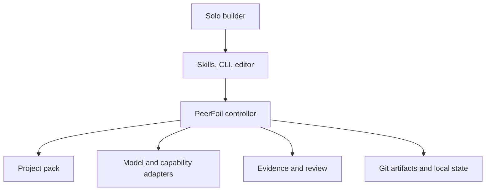
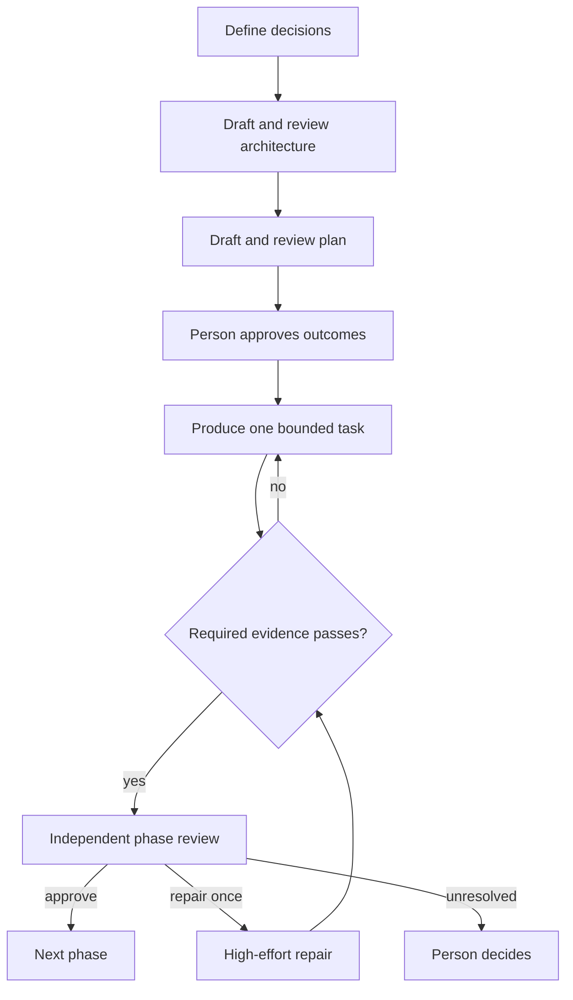

<!--
Project:  PeerFoil  |  File: docs/architecture.md
Authors:  Gabriel Mongefranco (@gabrielmongefranco)
Created:  2026-09-04  |  Modified: 2026-09-04
Summary:  Defines PeerFoil's coding-first, artifact-neutral orchestration architecture.
SPDX-License-Identifier: GFDL-1.3-or-later
-->

# PeerFoil Architecture

## Coding-first, artifact-neutral orchestration for independent AI peers

- **Version:** 0.1, 4 September 2026
- **Status:** Pre-implementation architecture
- **Software license intent:** `GPL-3.0-or-later`
- **Documentation license intent:** `GFDL-1.3-or-later`

## 1. Purpose and scope

PeerFoil coordinates existing AI agents through a controlled lifecycle for decisions, architecture, planning, production, validation, independent review, repair, and durable learning. It is designed primarily to help one developer produce stable, accessible, secure, maintainable software without pretending that a collection of models is a complete professional team.

The orchestration protocol is artifact-neutral. Software is the default and most capable project pack, while documentation, business plans, research reports, and later custom deliverables use the same controller through declarative project packs.

This document defines the architecture of the PeerFoil product and repository. A generated `.peerfoil/architecture.md` inside a user's workspace is different: it describes that user's project and is produced by the Architect role.

## 2. Goals

- Make the normal experience feel like five actions: start, change, status, resume, and remember.
- Use a high-capability model to resolve consequential decisions and architecture.
- Use a fresh planning session to compile approved architecture into phases, stages, and bounded tasks.
- Use qualified producers for implementation or other artifact creation.
- Prevent any agent or model family from independently approving its own output.
- Bind acceptance to fresh executable, inspectable, or human evidence.
- Revise the plan after every accepted change, deferral, TODO, deviation, skipped check, backlog placement, or decline.
- Keep accepted decisions and artifacts portable in Git rather than a hosted control plane.
- Select pertinent skills, MCP capabilities, context, and lessons automatically within explicit policy.
- Support hosted providers and qualified local models through one seat contract.
- Run natively on Windows, macOS, and Linux.
- Require no paid service other than whichever LLM inference the user chooses.
- Ship a useful guided Skills release by Day 5, an enforced Core Alpha by Day 13, and the planned 1.0 scope by Week 26.

## 3. Non-goals

PeerFoil is not:

- another coding agent or model runtime;
- a general workflow language;
- an operating-system sandbox;
- a hosted control plane or required account;
- an enterprise project-management, RBAC, billing, or collaboration system;
- a replacement for Git, Claude Code, Codex, MCP, local-model runtimes, or project-native tools;
- an office editor, market-data provider, research database, or domain expert;
- a guarantee or certification of correctness, security, accessibility, viability, or regulatory fitness;
- an automatic deployment or production-change system;
- a multi-writer system in its initial releases.

## 4. System context



PeerFoil wraps existing tools through process, file, and protocol boundaries. Claude Code, Codex, Git, MCP servers, validators, and local-model runtimes remain independently installed systems. PeerFoil owns coordination and policy; it does not reimplement their core functionality.

## 5. Architectural principles

### 5.1 Coding-first, artifact-neutral

The Software Pack may optimize aggressively for code, repositories, tests, and worktrees. Those assumptions must not leak into the controller when they can be expressed by a pack. Core uses the neutral concepts `workspace`, `artifact`, `producer`, `change_set`, `validator`, `acceptance_contract`, and `deliverable`.

### 5.2 Models propose; the controller commits

Models may propose decisions, plans, changes, findings, and lessons. Core validates schemas, verifies eligibility, runs executable checks, enforces transitions, records provenance, and commits accepted state. A model's statement that a command passed is not evidence.

### 5.3 Independent review follows provenance

The exact authoring agent and run cannot approve their output. Normal independent approval comes from a fresh, qualified model with a different canonical lineage root from every author of the item. A fresh reviewer from the same lineage may contribute findings but cannot satisfy the independent-approval requirement.

### 5.4 Project files remain understandable

Accepted project truth is human-readable Markdown, versioned structured data, and Git history. Raw transcripts, private MCP payloads, temporary attempts, and provider session details are local operational data, not project truth.

### 5.5 One lifecycle, small packs

Packs configure a fixed PeerFoil lifecycle. They do not define arbitrary programs or bring their own orchestration engines. Adding a normal pack should require manifests, templates, schemas, validators, skills, and review lenses—not controller code.

### 5.6 Simple by default

Normal operation exposes the project outcome, current phase/stage/task, quality status, and decisions requiring a person. Provider routing, model effort, pass budgets, skills, MCP, local endpoints, costs, and standards sources remain under Advanced settings.

## 6. Universal lifecycle

```text
Define → Architect → Plan → Produce → Validate → Review → Repair → Approve
```



Every project uses:

```text
Project → Phase → Stage → Task
```

- A **project** binds a workspace, project pack, standards profile, providers, and accepted state.
- A **phase** produces a releasable or otherwise reviewable increment and ends in full review.
- A **stage** is a user-visible outcome within a phase.
- A **task** is one bounded producer assignment tied to one plan revision and basis revision.

### Transition invariants

| Transition | Required conditions |
|---|---|
| Define → Architect | No unresolved consequential decision, or an explicitly visible assumption |
| Architect → Plan | Architecture and acceptance contract have eligible different-lineage review; required findings are resolved or explicitly accepted; person accepts the result |
| Plan → Produce | Plan has eligible different-lineage review; material human edits are revalidated; stage order is approved; task is unblocked, bounded, and tied to current plan revision |
| Produce → Validate | Change set captured with author, run, basis, scope, and affected artifacts |
| Validate → Review | Required task and phase evidence is fresh and bound to the reviewed revision |
| Review → Repair | Findings are normalized; exact repair producer selected within the pass budget |
| Repair → Approve | Affected evidence rerun; repair receives fresh approval from another canonical lineage root |
| Any state → Pause | Required evidence fails, consequential choice remains, budget expires, authorization is missing, or convergence ends |

No transition silently substitutes a model, effort level, pack, evidence method, or standards source.

## 7. Architectural layers

### 7.1 User surfaces

The initial surfaces are:

- a Claude Code plugin and portable Markdown skills;
- the native `peerfoil` CLI;
- VS Code terminal integration and checked-in tasks;
- ordinary project files that remain editable without PeerFoil.

The stable normal command vocabulary is:

```text
peerfoil start
peerfoil change
peerfoil status
peerfoil resume
peerfoil remember
```

`peerfoil settings` exposes advanced configuration and is omitted from normal help unless requested. A dedicated VS Code activity view, desktop application, and web interface remain outside 1.0.

### 7.2 Workflow controller

Core contains a deterministic state loop responsible for:

- loading and validating accepted state;
- determining the next permitted transition;
- assembling a role-specific request;
- invoking an eligible model seat;
- validating structured output;
- running or registering evidence;
- integrating accepted changes;
- appending a durable, redacted transition event;
- recovering or stopping honestly after interruption.

It does not contain a second prompt system. The same skills and templates used by the Skills Edition remain the human-readable policy; Core supplies structural enforcement.

### 7.3 Project-pack loader

The loader resolves a pinned built-in or external pack, validates its schema and license policy, and exposes only declared data to the controller. A pack defines:

- names and normal-interface labels;
- artifact and deliverable types;
- default phase, stage, and task templates;
- role aliases, eligibility, and effort defaults;
- applicable skills and requested MCP capability classes;
- validators and accepted evidence types;
- specialist review lenses;
- completion criteria.

The loader rejects a pack that attempts to override core invariants, expand credentials, widen permissions, suppress provenance, accept failed required evidence, or authorize self-review.

### 7.4 Provider adapters

Every provider adapter implements one seat lifecycle:

```text
discover → diagnose → invoke → wait/stream → cancel → parse → report usage
```

The first adapters invoke separately installed Claude Code and Codex CLIs. Later adapters support Ollama, OpenAI-compatible endpoints such as vLLM, and optional local harnesses.

Each invocation records:

- configured `agent_id`;
- unique `agent_instance_id` and `run_id`;
- provider, concrete model, canonical `lineage_root_id`, lineage evidence and resolution source, role, and effort;
- input artifact and policy revisions;
- selected skills and permitted MCP capabilities;
- output schema version, status, timing, and available usage data.

PeerFoil stores no vendor token. It reuses provider-native authentication and reports the resolved route.

Model independence is not accepted from a model's own claim or an endpoint alias. Adapters normalize hosted models through a pinned provider catalog. Local-model manifests record base model, derivative relationship, source, and model digest. Aliases, quantizations, fine-tunes, and checkpoints inherit the base `lineage_root_id` unless independent lineage is established. Unknown or conflicting lineage cannot satisfy independent approval and results in `Reduced assurance`. “Family” remains a user-facing term; Core enforces lineage roots.

### 7.5 Capability router

The router creates a least-context packet from:

- approved architecture and the relevant plan slice;
- applicable workspace artifacts;
- effective `AGENTS.md` and provider bridge;
- the selected pack;
- eligible, pinned skills;
- allowed and healthy MCP sources;
- approved lessons;
- current evidence and findings.

Skill eligibility is derived from role, pack, task type, stack, paths, risk, operating system, required tools, MCP needs, and adapter capability. Retrieved MCP content is untrusted data. It cannot override standards, permissions, plan state, or controller instructions.

In Enforced mode, every invocation receives an ephemeral provider-native MCP configuration containing only role-allowlisted servers and tools. The adapter also applies deny-by-default tool filtering and references credentials without copying them into project state. An adapter that cannot enforce both configuration isolation and tool filtering is not eligible for role-scoped MCP. Required access then blocks; optional access is omitted and recorded. The Skills Edition can only guide this boundary and reports it as Guided.

### 7.6 Workspace and provenance manager

Git is the canonical version and integration mechanism. The Software Pack uses one short-named task worktree branched from an integration branch. Text-oriented packs may use the same mechanism for Markdown, structured data, diagrams, and generated sources.

Each material artifact and change set records its internal author run, concrete model, canonical `author_lineage_root_id`, lineage resolution and evidence reference, basis revision, and resulting patch or content digest. Reviews durably record the reviewer lineage roots and eligibility decision. Mechanical application preserves attribution. Any rewrite, tidy-up, generated conflict resolution, or manual change becomes a separately attributed change set requiring its own independent approval.

Binary deliverables should normally be generated from reviewable source. Where that is impractical, the workspace retains the editable source of record plus inspectable render evidence.

Worktrees isolate version-control changes. They do not restrict filesystem, network, process, or credential access.

### 7.7 Evidence engine

Evidence has three supported forms:

1. **Executable evidence:** a command with expected status or structured result, run by Core.
2. **Inspectable evidence:** a retained structured inspection by an agent, browser, or platform tool.
3. **Human evidence:** an explicit procedure and expected result confirmed by a person.

For executable evidence, Core records the executable and argument array, working directory, exit status, duration, timeout, relevant tool and configuration versions, exact workspace revision, and retained or redacted output reference.

Required failed or missing evidence blocks acceptance and cannot be voted away. Human-accepted exceptions produce `Passing with accepted risks`, never `Passing`.

### 7.8 Review council

At each phase boundary, the controller freezes an identical review bundle for both reviewer seats. It contains accepted decisions, architecture, plan, acceptance contract, changes, provenance, evidence, TODOs, unsupported claims, deviations, deferrals, and known risks.

Before production, architecture and plan each pass a smaller independent gate: one different-lineage critique, one author revision, and one independent verification. An unresolved blocker then pauses for the person. These gates prevent unreviewed governing artifacts without consuming the later phase-council budget.

Reviewers work in fresh sessions and exchange a normalized finding ledger rather than transcripts. Every blocker or high-severity finding receives `agree`, `disagree_with_evidence`, or `needs_evidence`. Silence becomes `needs_evidence`.

The default budget is six passes per reviewer for the entire phase, including post-repair verification; eight is the absolute maximum. One pass per configured reviewer is reserved at the start for the post-repair bundle. Pre-repair reconciliation cannot consume it. If no accepted repair plan and eligible different-lineage verifier exist before that reserve, PeerFoil pauses rather than starting an unverifiable repair. Repair-producer selection receives three passes per reviewer by default and four maximum. One automatic repair cycle is allowed. The repair always uses high effort and receives fresh verification from a qualified different lineage.

If no qualified independent family is available, PeerFoil reports `Reduced assurance` and requires explicit human acceptance or waits for another reviewer.

### 7.9 Memory refinery

Raw transcripts never become durable memory automatically. An observation is classified, scoped, sourced, and reviewed before promotion:

| Observation | Durable form |
|---|---|
| Product or architecture consequence | Decision record |
| Recurring defect | Regression test or rule |
| Reusable procedure | Skill |
| Stable standard or preference | Proposed `AGENTS.md` change |
| Domain meaning | Glossary entry |
| Useful nonbinding knowledge | Sourced, dated lesson |
| Machine-specific fact | Ignored local note |

Personal and work memories remain separate. Cross-project promotion is explicit.

## 8. Project packs

### 8.1 Neutral mapping

| Core concept | Software | Documentation | Business Plan | Research Report |
|---|---|---|---|---|
| Artifact | Source/test/configuration | Section/diagram/source | Narrative/model/evidence | Question/source/synthesis |
| Producer | Coder | Writer/technical author | Analyst/writer | Researcher/synthesizer |
| Validator | Build/lint/test/scanner | Link/style/structure/fact check | Formula/source/consistency check | Citation/source/traceability check |
| Acceptance contract | Quality Contract | Editorial and technical contract | Evidence and viability contract | Evidence and methodology contract |
| Deliverable | Working release | Publishable document | Reviewed plan | Reviewed report |

### 8.2 Built-in packs

| Pack | Release posture |
|---|---|
| Software | Default and fully supported from the first release |
| Generic | Minimal schema and extension base from the first release |
| Documentation | Small reference in Skills 0.1; mature by 1.0 |
| Business Plan | Prototype after Reliable Core; mature by 1.0 |
| Research Report | Prototype after Reliable Core; mature by 1.0 |
| Proposal/RFP | Candidate post-1.0 extension |

The Day-13 alpha mechanically enforces the Software Pack first and processes a small Documentation fixture to guard artifact neutrality. That fixture is architectural evidence, not a claim of polished non-code support.

### 8.3 Non-code evidence model

Non-code packs distinguish:

- verified facts with source and date;
- calculated results with inputs, formulas, units, and checks;
- explicit assumptions with ownership and sensitivity;
- clearly labeled model judgments;
- unsupported claims that require evidence, revision, or risk acceptance;
- consistency, readability, structure, and accessibility inspections;
- human judgment where automation would be misleading.

The Business Plan Pack may use skeptical-investor, customer, operations, financial, and evidence lenses. These are review perspectives, not simulated proof of commercial viability. The Research Report Pack records source selection and limitations and never treats model synthesis as primary evidence.

## 9. Canonical data model

| Entity | Principal fields |
|---|---|
| `Project` | Profile, selected pack and version, schema version, providers, current revision |
| `Decision` | Question, alternatives, recommendation, answer or assumption, consequences, status |
| `Architecture` | Goals, constraints, non-goals, accepted decisions, risks |
| `AcceptanceContract` | Applicable quality dimensions, validators, evidence, exceptions |
| `PlanRevision` | Phases, stages, tasks, dependencies, change rationale, superseded items |
| `Task` | Outcome, inputs, risk, producer eligibility, evidence, basis, status |
| `InvocationProvenance` | Internal run ID, agent, provider/model, canonical lineage root, lineage resolution source and evidence reference, role, input/output revisions |
| `Artifact` | Identifier or path, type, revision, author run, author lineage root, lineage evidence reference, content digest |
| `ChangeSet` | Basis revision, affected artifacts, author run, author lineage root, lineage evidence reference, scope and digest |
| `EvidenceRecord` | Method, result, exact revision, freshness, retained reference |
| `Finding` | Severity, claim, evidence, affected items, disposition, owner |
| `Review` | Reviewer run and lineage root, author lineage roots, eligibility basis, independence status, findings, decision, pass count |
| `Lesson` | Scope, trigger, source, verification, review or expiry date |
| `CapabilityProfile` | Tools, skills, MCP access, model qualifications, platform constraints |

All machine records are schema-versioned. Stable IDs are generated by the controller, not inferred from mutable labels. Human-readable Markdown is retained alongside machine-valid JSON where people must review or approve content.

## 10. Persistence

Committed project truth:

```text
.peerfoil/
  project.json
  decisions.md
  architecture.md
  quality.md
  plan.md
  plan.json
  glossary.md
  lessons.md
  history.jsonl
  provenance.jsonl
  evidence/
  reviews/
  packs/
skills/
AGENTS.md
CLAUDE.md
```

Ignored local application data contains provider session identifiers, raw logs, temporary attempts, private MCP payloads, caches, worktrees, and a rebuildable operational index. No database service is required. Git artifacts plus compact transition and provenance histories must be sufficient to reconstruct accepted state and independently audit its review eligibility on another machine.

`history.jsonl` and `provenance.jsonl` are schema-versioned, redacted, and single-writer. A partial final line after a crash is ignored. They contain accepted transitions, internal run IDs, model/lineage mappings, artifact digests, review eligibility, and evidence references—not provider sessions, transcripts, or full command output.

## 11. Principal flows

### 11.1 New project

1. Detect the Git workspace, selected personal/work standards profile, platform, tools, and provider authentication.
2. Select Software by default or another installed project pack.
3. Ask at most three plain-language consequential questions at a time until none remain unresolved.
4. Generate architecture and the pack-aware acceptance contract in a fresh Architect session.
5. Obtain mandatory provenance-eligible different-lineage architecture review, dispose findings, and obtain human acceptance.
6. Compile a fresh plan, obtain mandatory different-lineage plan review, and let the user reorder, split, drop, or prioritize stages.
7. Revalidate and re-review any material human plan change.
8. Freeze the first task packet and begin automatic production.

### 11.2 Task execution

1. Verify that the task belongs to the current plan revision and its dependencies are satisfied.
2. Select a qualified producer and assemble least context.
3. Produce one bounded change set.
4. Capture scope and provenance before any other content edit.
5. Run controller-owned validators and register inspectable or human evidence.
6. Reject out-of-scope changes or failed required evidence.
7. Integrate accepted work and append the transition.

### 11.3 Change intake

1. Accept a request at a task boundary.
2. Use high effort, or extra high for architecture changes, to assess impact.
3. Place it in the current task/stage, next stage, later phase, backlog with trigger, or decline with reason and trigger.
4. Increment the plan revision in every case.
5. Invalidate only affected tasks and evidence.
6. Reopen consequential decisions when necessary; otherwise continue automatically.

### 11.4 Phase review and repair

1. Freeze the reviewed revision, artifacts, evidence, provenance, deviations, and risks.
2. Run pack- and risk-selected specialist lenses.
3. Send the same bundle independently to both reviewer families.
4. Reconcile findings within the ledger and pass budget.
5. Select one high-effort repair producer by exact configured ID.
6. Rerun affected evidence and issue a new frozen bundle.
7. Obtain fresh cross-family approval or pause for the user.

### 11.5 Resume and recovery

Core reconstructs the last accepted state from Git and transition history. It never infers that an interrupted external process succeeded. At a task boundary it resumes from the next valid transition. An ambiguous in-flight change is quarantined for inspection, not silently merged or rerun.

## 12. Default role routing

| Role | Hosted default | Effort | Independence rule |
|---|---|---:|---|
| Evaluator | Claude Code Fable; Opus fallback | Extra high | Decisions only |
| Architect | Fresh Claude Code Fable; Opus fallback | Extra high | Cannot approve architecture |
| Planner | Fresh Claude Code Fable; Opus fallback | High | Cannot approve plan |
| Change steward | Claude Code Fable; Opus fallback | High or extra high | Plan revisions only |
| Software producer | Codex 6; GPT-5.6 Sol fallback | High by default | Cannot approve produced change |
| Reviewer A | Fresh Claude Fable; Opus fallback | Extra high | Primary for eligible non-Claude work |
| Reviewer B | Fresh Codex 6; GPT-5.6 Sol fallback | Extra high | Primary for eligible non-Codex work |
| Repair producer | Review-council selection | High only | Removed from review seat for repair |

Concrete model and effort support is discovered at runtime. Unsupported or undeclared substitution stops. Packs may choose a different qualified producer when the task is not coding; reviewer independence remains provenance-based.

A local model may occupy a seat only after passing that role and pack's qualification fixtures. An unqualified local model begins read-only. A local-only normal-assurance configuration requires two qualified, distinct canonical lineage roots with pinned lineage evidence; aliases or derivatives of one base do not count twice.

## 13. Trust and authorization boundaries

PeerFoil enforces:

- no self-approval;
- different-lineage primary review under normal assurance;
- controller-owned executable evidence;
- schema and plan-revision checks;
- pinned standards, skills, packs, and capability policy;
- role-scoped MCP access;
- no committed secrets or raw private MCP payloads;
- explicit approval for destructive, external, credential, deployment, or production actions;
- visible fallbacks, exceptions, and reduced-assurance states.

PeerFoil assumes the workspace, its hooks, dependencies, scripts, tools, and invoked agents are trusted. The initial product supplies no operating-system sandbox. Worktrees are provenance and change-isolation mechanisms only. Untrusted workspaces require an external disposable environment outside this architecture.

## 14. Cross-platform contract

Core is a small Go executable targeting native Windows, macOS, and mainstream Linux on x64 and arm64 where upstream provider tools support them.

Implementation requirements:

1. Invoke executable/argument arrays without shell interpolation.
2. Store canonical project paths with `/` and convert only at I/O boundaries.
3. Use short branch and worktree names.
4. Parse machine-readable Git output.
5. Keep local state out of synchronized or network directories by default.
6. Terminate full process trees on cancellation and timeout, including Windows Job Objects or a validated fallback.
7. Never mix native and compatibility-layer paths in one project.
8. Test spaces, Unicode, apostrophes, CRLF, case-only changes, dirty trees, crashes, and timeouts on all three systems from the first commit.

Core requires no Docker, WSL, Bash, tmux, Unix socket, symlink, native add-on, database service, or hosted account.

## 15. Failure behavior

| Failure | Required behavior |
|---|---|
| Missing tool or authentication | Stop with one exact next action |
| Unsupported model or effort | Stop or use only a declared visible fallback |
| Malformed model output | One bounded repair request, then stop |
| Task validator failure | Retry within policy; never integrate failing work |
| Required MCP source unavailable | Block the dependent task |
| Adapter cannot isolate requested MCP access | Reject that capability; block if required, otherwise omit and record |
| Unexpected live-workspace mutation | Stop and preserve evidence |
| Timeout or cancellation | Terminate process tree and record interrupted status |
| Review disagreement | Continue only within pass budget, then pause with the disagreement |
| Required evidence missing | Block acceptance |
| State corruption | Reconstruct from accepted Git state or stop; never guess |
| Version/schema incompatibility | Run an explicit migration or refuse to continue |

## 16. Release evolution

| Release | Deadline | Architecture boundary |
|---|---:|---|
| PeerFoil Skills 0.1 | Day 5 | Guided plugin/Markdown workflow; Software, Generic, and small Documentation reference packs; official Codex plugin; file-based state |
| PeerFoil Core Alpha 0.2 | Day 13 | Go state loop; Software-first pack enforcement; sequential tasks; worktrees; authoritative evidence; task-boundary recovery; one dual-family review/repair path |
| PeerFoil 1.0 | Week 26 | Mature review and change control, memory, deterministic skill routing, MCP, qualified local models, mature built-in packs, quality/release gates, and native packaging |

The schemas, skills, pack contract, artifacts, and role boundaries remain shared across releases. Core strengthens enforcement without replacing the Skills workflow or making accepted projects dependent on a service.

## 17. Open-source and licensing boundary

The combined PeerFoil software distribution is intended to remain compatible with `GPL-3.0-or-later`. Source, tests, skills, agent definitions, packs, templates, schemas, plugin metadata, configuration, and executable or machine-consumed Markdown are software or operational artifacts under that license. Human-facing prose documentation uses `GFDL-1.3-or-later` unless a file carries another SPDX identifier; an explicit file identifier wins over its path. Existing capabilities are reused through reviewed dependencies or external process boundaries:

- the official [Codex plugin for Claude Code](https://github.com/openai/codex-plugin-cc);
- [Codex CLI](https://github.com/openai/codex);
- [Agent Skills](https://agentskills.io/specification);
- [Model Context Protocol](https://modelcontextprotocol.io/);
- Git and project-native validators;
- optional compatible scanners and local-model runtimes.

A process boundary does not erase license obligations. Distributed modules, copied templates or skills, release archives, and model artifacts are audited independently. Required notices, complete license texts, and an SBOM accompany applicable releases.

## 18. Architecture acceptance criteria

The architecture is preserved only if:

1. Software remains the best-supported default without software-only controller assumptions.
2. Packs can change domain artifacts and evidence without changing governance invariants.
3. No authoring agent can independently approve its own artifact or change set.
4. Required executable evidence is produced by Core, not accepted from model narration.
5. Every accepted state and its reviewer-lineage eligibility can be reconstructed from Git without raw transcripts, provider sessions, or private payloads.
6. Provider, skill, MCP, memory, pack, and fallback choices are visible and attributable.
7. Normal operation requires no hand-edited configuration.
8. Windows, macOS, and Linux behavior is tested continuously.
9. No non-LLM paid service or hosted component is required.
10. Skills, Core, and future packs use the same lifecycle and durable artifacts.
11. Failure, uncertainty, reduced assurance, and accepted risk are never relabeled as success.

## Primary references

- [PeerFoil method](PeerFoil-Method.md)
- [High-level implementation plan](implementation-plan.md)
- [Claude Code documentation](https://code.claude.com/docs)
- [Codex plugin for Claude Code](https://github.com/openai/codex-plugin-cc)
- [Codex CLI](https://developers.openai.com/codex/cli)
- [Agent Skills specification](https://agentskills.io/specification)
- [Model Context Protocol](https://modelcontextprotocol.io/)
- [Git worktrees](https://git-scm.com/docs/git-worktree)
