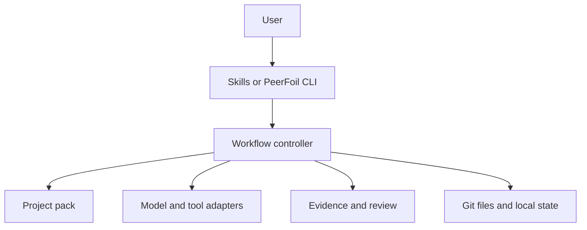
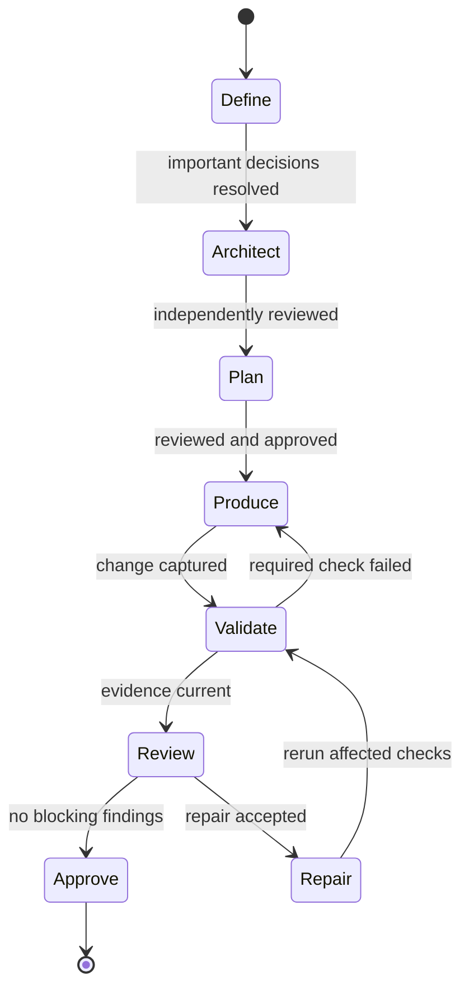

<!--
This file is part of PeerFoil.
docs/architecture.md
Author(s): Gabriel Mongefranco.
Created: 2026-09-04
Last Modified: 2026-09-05
Summary: Describes PeerFoil's components, data, workflow, and main design decisions.
Notes: See README for an overview and full license information.

Copyright © 2026 Gabriel Mongefranco

Permission is granted to copy, distribute and/or modify this document under the terms of
the GNU Free Documentation License, Version 1.3 or any later version published by the Free
Software Foundation; with no Invariant Sections, no Front-Cover Texts, and no Back-Cover
Texts. See <https://www.gnu.org/licenses/fdl-1.3.html>.
-->

# PeerFoil Architecture

## How PeerFoil coordinates independent AI models without replacing their tools

[Return to the PeerFoil README](../README.md)

PeerFoil is a small local coordinator. It uses existing AI coding tools, Git, project
checks, skills, and connected knowledge sources. Its job is to decide what happens next,
give each model the right information, record the result, and prevent work from being
approved without independent review and current evidence.

Software is the first and most complete use. The main controller is not limited to code,
so project packs can apply the same workflow to documentation, business plans, research
reports, and other work. This page describes the planned technical design.

## 1. Design goals

PeerFoil must:

- feel simple to a person building mostly alone;
- use a high-capability model for decisions and architecture;
- turn an approved architecture into small, ordered tasks;
- keep producers from approving their own work;
- prefer a different model family for independent review;
- use current test results and other evidence before accepting work;
- update the plan whenever requirements or discovered work change;
- keep accepted project information in ordinary files and Git;
- load only the skills, memories, and Model Context Protocol (MCP) servers needed for a
  task;
- support hosted and qualified local models;
- work natively on Windows, macOS, and Linux; and
- require no paid non-LLM service.

PeerFoil is not a model, code editor, Git replacement, project-management suite, hosted
service, or operating-system sandbox. It also does not certify the quality or safety of
the work it helps produce.

## 2. System overview



The user starts or changes a project through skills or the command-line application. The
controller loads the selected project pack and current project state. It calls the right
model or tool for one step, validates the result, records evidence, and advances only when
the next step is allowed. Accepted decisions, plans, reviews, and lessons stay in Git.

PeerFoil wraps existing tools through command, file, and protocol boundaries. Claude Code,
Codex, Git, MCP servers, project validators, and local-model runtimes remain separate
applications. PeerFoil coordinates them instead of rebuilding them.

## 3. Main design decisions

### 3.1 Coding first, but not code only

The Software Pack can use repositories, tests, builds, and Git worktrees. Those details do
not belong in the controller itself. Core uses broader names such as workspace, artifact,
producer, change set, validator, evidence, and deliverable.

This keeps software development efficient while allowing other project types to use the
same review and evidence rules.

### 3.2 Models suggest; PeerFoil records

Models can suggest decisions, plans, changes, findings, and lessons. The controller checks
their structure, confirms that the model was allowed to perform the role, runs required
commands, records authorship, and saves accepted state.

A model cannot make its own test result authoritative by writing “passed.”

### 3.3 Review follows authorship

Every important artifact and change set records who created it. The exact agent and session
that created an item cannot approve it. Normal approval also requires a qualified model
from a different underlying family.

PeerFoil calls that underlying family a **lineage root**. Aliases, fine-tunes, checkpoints,
and quantized copies of the same base model share one lineage root. This prevents two names
for nearly the same model from being treated as independent reviewers.

### 3.4 Project files remain readable

A developer must be able to open the accepted project files without PeerFoil. Markdown and
versioned JSON are the main formats. Raw conversations, private MCP responses, temporary
attempts, and provider session details stay in local operational storage.

### 3.5 One workflow, small project packs

A project pack changes the artifacts, checks, and review areas for one type of work. It
does not define a new workflow engine or receive permission to run arbitrary controller
code.

### 3.6 Simple by default

Normal screens and commands show the goal, current work, quality state, and decisions that
need the user. Provider routing, effort, pass limits, skills, MCP access, costs, and local
model settings remain under Advanced settings.

## 4. Workflow states

The fixed lifecycle is:

```text
Define → Architect → Plan → Produce → Validate → Review → Repair → Approve
```



In plain language, PeerFoil does not start production until the important decisions,
architecture, and plan are ready. Each production task is captured before validation.
Failed checks return the task for correction. A phase can close only after review, any
accepted repair, and fresh validation.

PeerFoil pauses from any state when it needs a user decision, permission, authentication,
human check, or accepted risk. It also pauses when a retry or review limit is reached.

### Required transitions

| Move | What must be true |
|---|---|
| Define to Architect | Important decisions are answered or visible as assumptions |
| Architect to Plan | Another model family reviewed the architecture; the user accepted it |
| Plan to Produce | Another model family reviewed the plan; the user approved stage order |
| Produce to Validate | The change set and its author were recorded |
| Validate to Review | Required evidence matches the exact revision under review |
| Review to Repair | Findings are specific; both reviewers agree on the repair and producer |
| Repair to Approve | Affected checks ran again; another model family verified the repair |

No transition quietly changes the model, effort, project pack, evidence method, or project
rules.

## 5. Main components

### 5.1 User interface

The first interfaces are:

- a Claude Code plugin and Markdown skills;
- the native `peerfoil` command-line application;
- VS Code through its terminal and checked-in tasks; and
- ordinary project files that can be read and edited without PeerFoil.

The stable normal commands are:

```text
peerfoil start
peerfoil change
peerfoil status
peerfoil resume
peerfoil remember
```

`peerfoil settings` opens Advanced settings. A dedicated desktop application, web
dashboard, and large VS Code panel are outside the first release.

### 5.2 Workflow controller

The controller performs one permitted step at a time:

1. Load and validate accepted project state.
2. Decide which transition is allowed next.
3. Build a small request for the selected role.
4. Call an eligible model or tool.
5. Validate the response.
6. Run or register required evidence.
7. Save the accepted change and its author.
8. Append a redacted history record.
9. Continue, recover, or stop with a clear reason.

The controller uses the same skills and templates as the Skills release. It adds reliable
state and enforcement rather than a second, hidden prompt system.

### 5.3 Project-pack loader

The pack loader checks a built-in or pinned external project pack before use. A pack may
define:

- artifact and deliverable types;
- common phases and stages;
- role instructions;
- evidence types and validators;
- review areas;
- completion requirements; and
- optional skill and MCP needs.

A pack cannot override `AGENTS.md`, grant credentials, relax reviewer independence, or
turn a failed required check into a pass.

### 5.4 Model adapters

All model providers implement one small contract:

```text
check capabilities → start fresh session → send request → stream events
→ return structured result → cancel when requested
```

An adapter reports its supported models, effort settings, tools, context limit, structured
output support, authentication state, and model lineage. The controller checks these facts
before assigning a role.

The first adapters call Claude Code and Codex as separate local processes. Later adapters
support Ollama, vLLM, and compatible local or hosted endpoints. PeerFoil uses each tool's
normal login and does not store its token.

### 5.5 Skills and MCP broker

The broker selects the approved skills and MCP capabilities needed by the current task.
It applies limits by role, project, server, and operation.

Retrieved content is data, not instruction. A document or MCP response cannot change
PeerFoil's policy, widen its own access, or expose credentials. Important outside facts
keep a source reference and retrieval date.

### 5.6 Git workspace manager

The Software Pack uses a separate Git worktree and branch for one production task. This
keeps incomplete edits away from the user's current checkout and preserves the producer's
original change before integration.

The manager:

- requires a clean starting point;
- records the base commit and plan revision;
- allows one producer to write at a time;
- captures the producer's patch before another agent changes it;
- checks for unexpected files and secrets;
- integrates only accepted work; and
- records the author of conflict-resolution edits separately.

Git worktrees isolate changes. They are not a security boundary.

### 5.7 Evidence runner

The evidence runner starts commands with argument arrays, not assembled shell strings. It
uses an explicit working directory, timeout, environment allowlist, and captured output.

Each result includes:

- the project and plan revision;
- the command and working directory;
- the exit code, duration, and tool version;
- hashes for relevant configuration and inputs; and
- references to retained output.

Inspectable and human evidence use similarly structured records. Sensitive output is
redacted before storage.

### 5.8 Review coordinator

At the end of each phase, the review coordinator freezes the deliverables, changes,
evidence, requirements, plans, and known risks.

Claude and Codex review that same package independently at extra-high effort. Findings are
normalized by location, requirement, severity, evidence, and proposed action. Duplicate
findings are combined without hiding disagreement.

The default limit is six passes per reviewer; eight is the maximum. One pass is reserved
for checking a repaired result. Selecting the exact repair producer uses three passes by
default and four at most. Only one automatic repair cycle is allowed.

### 5.9 Memory manager

The memory manager keeps four kinds of information separate:

- accepted project decisions;
- temporary run state;
- retrieved task context; and
- reviewed lessons.

A lesson is promoted only after its trigger, scope, source, and conflicts are checked.
Possible destinations include a decision record, test, skill, `AGENTS.md` proposal, pack
rule, or temporary hint with an expiration date.

## 6. Project files

A project using PeerFoil keeps accepted state under `.peerfoil/`:

```text
.peerfoil/
  project.json
  decisions.md
  architecture.md
  quality.md
  plan.md
  plan.json
  history.jsonl
  evidence/
  reviews/
  lessons/
```

### What each file does

| File | Purpose |
|---|---|
| `project.json` | Pack, schema, profile, role aliases, and accepted settings |
| `decisions.md` | Questions, answers, assumptions, and consequences |
| `architecture.md` | Project goals, boundaries, decisions, and risks |
| `quality.md` | Required checks and evidence methods |
| `plan.md` | Human-readable phases, stages, tasks, and changes |
| `plan.json` | Validated task, dependency, and evidence data |
| `history.jsonl` | Small, redacted records of accepted transitions |
| `evidence/` | Evidence metadata and approved retained results |
| `reviews/` | Findings, decisions, repairs, and approvals |
| `lessons/` | Candidate and accepted lessons |

Raw prompts, provider tokens, complete conversations, private knowledge-base content, and
temporary model output do not belong in these files.

### Important identifiers

Core uses stable identifiers for projects, phases, stages, tasks, requirements, evidence,
findings, model sessions, and change sets. Each accepted item also records:

- the plan revision that requested it;
- the source revision it started from;
- the producer and model lineage;
- the affected artifacts;
- the evidence that supports it; and
- the decision that accepted or rejected it.

This is enough to answer basic questions such as “Which requirement produced this change?”
and “Was this test run against the version the reviewers saw?”

## 7. Local operational state

Core starts with files and a small write-ahead journal so interrupted work can be detected.
Reliable Core adds SQLite in write-ahead logging mode for faster queries and recovery.

SQLite is a local cache, not the source of project truth. PeerFoil must rebuild it from Git
and the accepted `.peerfoil/` files.

Only the controller writes operational state. Every outside operation receives an
invocation identifier, so a restart can tell whether the operation never started, is still
running, or finished before the interruption.

Core Alpha guarantees recovery at task boundaries. Later releases add safer recovery for
review passes and other long-running operations.

## 8. Change handling

A new request creates a candidate plan revision. The change steward compares it with the
current architecture, active task, dependencies, risk, and cost of rework.

The steward places the request in the current stage, a later stage, a later phase, or the
backlog. Only affected work is reopened. Unrelated completed work remains valid.

Any task whose inputs changed becomes stale. It cannot be accepted until PeerFoil rebases
or replaces it and collects current evidence.

## 9. Non-coding project packs

The controller uses the same states for all project packs. The pack changes what “produce,”
“validate,” and “complete” mean.

| Pack | Main artifacts | Typical validators |
|---|---|---|
| Software | Source, tests, packages, documentation | Build, test, lint, scan, manual journey |
| Documentation | Outline, sections, examples, diagrams | Links, sources, readability, editorial review, render |
| Business Plan | Market, operations, finances, risks | Sources, formulas, assumptions, sensitivity checks |
| Research Report | Search, extraction, analysis, synthesis | Source capture, citations, calculations, limitations |
| Generic | Declared text or files | Commands, structured inspection, human procedure |

The first controller release enforces the Software Pack. It also processes a small
Documentation fixture to make sure code assumptions have not leaked into Core. Mature
non-coding packs arrive before 1.0.

## 10. Trust and security boundaries

PeerFoil enforces:

- validated model output before it affects state;
- explicit commands, directories, timeouts, and environment variables;
- role-based tool and MCP access;
- no producer self-approval;
- cross-family review when normal assurance is claimed;
- redaction before history or evidence is stored;
- no credentials in project files;
- explicit approval for destructive or external effects; and
- a stop when identity, lineage, evidence, or permission is uncertain.

PeerFoil assumes the workspace, its installed tools, and invoked model applications are
trusted. Version 1.0 does not provide an operating-system sandbox. Users who open untrusted
projects need an outside disposable environment.

Git worktrees and Dagger-style build environments may improve change isolation or
reproducibility. They are not treated as hostile-code security boundaries.

## 11. Cross-platform requirements

Core uses Go's standard process, path, filesystem, signal, and SQLite libraries wherever
possible. The default path cannot rely on:

- Bash or PowerShell scripts;
- WSL;
- Docker or another container runtime;
- Unix sockets;
- symlinks or case-sensitive paths;
- a writable installation directory; or
- a database or service running elsewhere.

Continuous integration tests Windows, macOS, and Linux. Test paths include spaces, Unicode,
long names, mixed separators, and case collisions. Provider and local-model adapters must
pass the same cancellation, timeout, and output tests on every supported platform.

## 12. Planned source layout

```text
cmd/peerfoil/              command-line entry point
internal/controller/       state transitions and policy
internal/project/          accepted project state
internal/pack/             pack loading and validation
internal/provider/         Claude, Codex, and local-model adapters
internal/capability/       skills and MCP selection
internal/workspace/        Git branches and worktrees
internal/evidence/         commands and evidence records
internal/review/           findings, limits, and repair decisions
internal/memory/           context and reviewed lessons
internal/store/            journal and SQLite cache
schemas/                   versioned JSON schemas
skills/                    portable workflow and review skills
agents/                    fresh role definitions
packs/                     built-in project packs
templates/                 human-readable project files
fixtures/                  cross-platform reference projects
docs/                      project documentation
```

Packages depend on small interfaces near the caller. Provider-specific code stays behind
adapters. Project packs use data and templates, not compiled controller extensions.

Before the controller exists, the PeerFoil Skills plugin ships its skills, agents, packs,
and templates inside `plugins/peerfoil/`, so that installing the plugin from a marketplace
delivers everything the skills need. Schemas live under `schemas/` from the start. Core
reads the same pack, template, and schema formats. The
[decision log](decision-log.md) records this choice.

## 13. Release boundaries

| Release | Architecture delivered |
|---|---|
| Skills 0.1 | Guided workflow, file state, Software and Generic packs, Documentation fixture |
| Core Alpha 0.2 | One enforced software path, direct Claude/Codex calls, evidence, task recovery |
| Reliable Core | Durable journal, SQLite cache, stronger process control and recovery |
| Review Beta | Frozen review packages, full limits, repair selection, focused reviewers |
| Planning Beta | Change impact, selective rework, traceability, early non-coding packs |
| Provider Beta | Local models, provider certification, capability checks, cost limits |
| Release Beta | Mature packs, installers, updates, custom-pack kit |
| PeerFoil 1.0 | Hardened three-platform release with complete documented scope |

## 14. Decisions deferred until implementation

The design intentionally waits for evidence before fixing:

- the exact Go SQLite library;
- the final schema library;
- the package and signing process for each operating system;
- the stable event format exposed by each model adapter;
- which local-model endpoints qualify for each role; and
- the final PeerFoil Claude Code marketplace name.

These choices can be made during the phase that first needs them. They do not change the
main workflow or user experience.

## Conclusion

PeerFoil is a local coordinator built around tools developers already use. Its controller
keeps the workflow honest: important decisions come first, production stays small, tests
and other evidence match the reviewed version, and another model family checks the work.

Project packs allow the same architecture to support non-coding work without weakening
the software-first design. Accepted information remains readable in Git, and advanced
model coordination stays out of the normal user's way.

## Additional Resources

- [PeerFoil method](PeerFoil-Method.md)
- [PeerFoil implementation plan](implementation-plan.md)
- [PeerFoil repository](https://github.com/gabrielmongefranco/peerfoil)
- [Git worktree documentation](https://git-scm.com/docs/git-worktree)
- [Model Context Protocol](https://modelcontextprotocol.io/)
- [Agent Skills specification](https://agentskills.io/specification)
- [Codex plugin for Claude Code](https://github.com/openai/codex-plugin-cc)

[Return to the PeerFoil README](../README.md)
